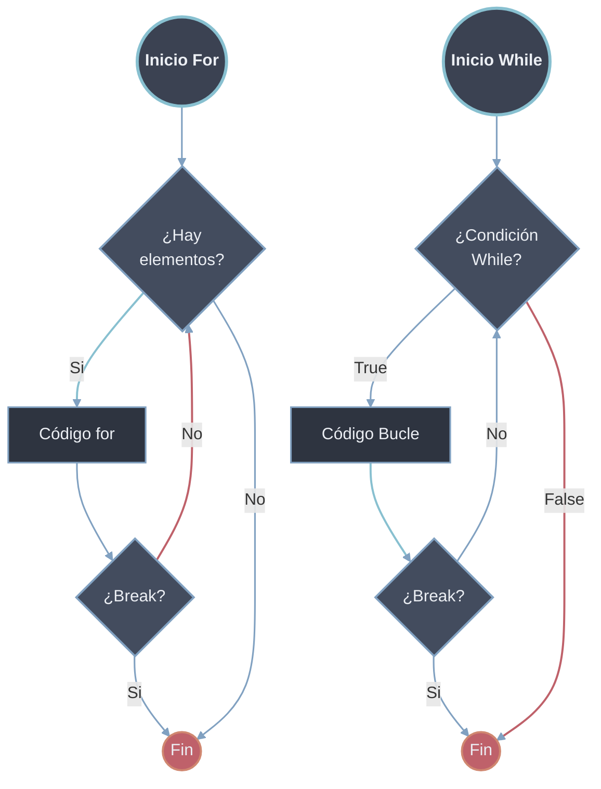

# Break

`break` termina inmediatamente el bucle más interno en el que se encuentra, sin importar si la condición del [[32 Bucles/index | bucle]] aún se cumple. Es el modificador de *interrupción*: corta el flujo iterativo en seco. Solo es válido dentro de `for` o `while`; usarlo fuera de un bucle produce `SyntaxError: 'break' outside loop`.

## Sintaxis y Comportamiento
```python
# break sale COMPLETAMENTE del bucle
while condición:
    # código antes
    if condición_especial:
        break  # Sale del bucle inmediatamente
    # código después (no se ejecuta si break se activa)

# Lo mismo aplica para for
for elemento in iterable:
    if condición:
        break  # Termina el bucle for
```

| Aspecto | Comportamiento de `break` |
| ------- | ------------------------- |
| **Alcance** | Solo el bucle **más interno** que lo contiene |
| **Condición del bucle** | Se ignora; no se vuelve a evaluar |
| **Código restante de la iteración** | No se ejecuta |
| **Cláusula `else` del bucle** | **No** se ejecuta (este es su efecto distintivo) |
| **Bloque `finally` de un `try`** | Se ejecuta antes de abandonar el bucle |
| **Fuera de un bucle** | `SyntaxError: 'break' outside loop` |



## `break` en `while` vs `for`

El efecto es idéntico en ambos bucles —abandonar la iteración—, pero el motivo para usarlo difiere.

| | `while` | `for` |
| --- | ------- | ----- |
| **Rol habitual de `break`** | Condición de parada *dentro* del cuerpo cuando la del `while` no la captura bien | Salida temprana al hallar lo buscado en un iterable |
| **Patrón típico** | `while True:` + `break` (bucle de evento / menú) | `for x in datos:` + `break` (búsqueda) |
| **Sin `break`** | Riesgo de bucle infinito si la condición no cambia | Recorre todo el iterable |

```python
# while True como bucle de evento: break es la ÚNICA salida
historial = []
while True:
    comando = input("> ")          # entrada del usuario
    if comando == "salir":
        break                       # única condición de término
    historial.append(comando)

print(historial)                    # ['ls', 'cd ..']  (ejemplo)
```

```python
# for con salida temprana: deja de iterar al primer match
for linea in ["info", "warn", "ERROR: fallo", "debug"]:
    if linea.startswith("ERROR"):
        print(f"Detenido en: {linea}")
        break
# Detenido en: ERROR: fallo
```

## Interacción con la cláusula `else` del bucle

`for` y `while` admiten una cláusula `else` que **solo se ejecuta si el bucle terminó de forma natural** (el `for` agotó el iterable o la condición del `while` se volvió falsa). Si el bucle se abandona con `break`, el `else` se **omite**. Esta es la propiedad central que convierte a `break`/`else` en el idioma de búsqueda de Python.

```python
# else se ejecuta SOLO si NO hubo break
for i in range(3):
    print(i)
else:
    print("else: bucle completado")     # SÍ se ejecuta
# 0
# 1
# 2
# else: bucle completado

for i in range(3):
    print(i)
    if i == 1:
        break
else:
    print("else: NO debería verse")     # NO se ejecuta
# 0
# 1
```

> [!tip] Cómo leer `for/else`
> Lee el `else` del bucle como **"si no se rompió"** (en inglés, *nobreak* habría sido un mejor nombre). No tiene relación con el `else` de un `if`; se ata al bucle, no a la última condición.

> [!warning] El `else` se omite también con `return` y excepciones
> Cualquier salida abrupta del bucle —`break`, un `return` que sale de la función, o una excepción que propaga— evita el `else`. Solo el agotamiento limpio del bucle lo dispara.

## Patrón de búsqueda: `for` / `else`

Idioma canónico para "buscar un elemento y reaccionar distinto según si se encontró o no", sin necesitar una bandera externa.

```python
# Buscar el primer múltiplo de 7; el else cubre el caso "no encontrado"
numeros = [12, 5, 21, 8]

for n in numeros:
    if n % 7 == 0:
        print(f"Encontrado: {n}")
        break
else:
    print("Ningún múltiplo de 7")
# Encontrado: 21
```

| Variante | Cuándo usarla |
| -------- | ------------- |
| `for/else` con `break` | Buscar y diferenciar "encontrado" de "no encontrado" sin bandera |
| Bandera booleana (`encontrado = True`) | Si necesitas el estado de la búsqueda *después* del bucle, para más lógica |
| `next((x for x in it if cond), None)` | Obtener el primer elemento que cumple, en una sola expresión |

```python
# Equivalente compacto con next(): sin bucle explícito ni break
numeros = [12, 5, 21, 8]
primer_mult7 = next((n for n in numeros if n % 7 == 0), None)
print(primer_mult7)   # 21
```

## Ejemplos Prácticos

### Búsqueda de Elemento
```python
# Ejemplo 1: Buscar un número en una lista
numeros = [3, 7, 2, 9, 4, 6]
buscar = 9
encontrado = False

for num in numeros:
    print(f"Revisando: {num}")
    if num == buscar:
        print(f"¡Encontrado {buscar}!")
        encontrado = True
        break  # Salimos del bucle al encontrar

print(f"¿Encontrado? {encontrado}")
# Revisando: 3
# Revisando: 7
# Revisando: 2
# Revisando: 9
# ¡Encontrado 9!
# ¿Encontrado? True

# Sin break tendríamos que procesar todos los elementos
# Con break ahorramos procesamiento innecesario
```

### Validación de Entrada con Límite
```python
# Ejemplo 2: Validar contraseña con intentos limitados
contrasena_correcta = "python123"
intentos_maximos = 3

for intento in range(1, intentos_maximos + 1):
    entrada = input(f"Intento {intento}/{intentos_maximos}: ")
    
    if entrada == contrasena_correcta:
        print("¡Acceso concedido!")
        break  # Salimos si la contraseña es correcta
    
    print("Contraseña incorrecta")
else:
    # Este else se ejecuta si NO se usó break (se agotaron los intentos)
    print("Demasiados intentos fallidos. Cuenta bloqueada.")
```

### Procesamiento Hasta Condición
```python
# Ejemplo 3: Sumar números hasta encontrar un negativo
numeros = [5, 3, 8, -2, 7, 4]
suma = 0

for num in numeros:
    if num < 0:
        print("¡Número negativo encontrado! Deteniendo suma...")
        break
    suma += num
    print(f"Sumando {num}. Total parcial: {suma}")

print(f"Suma total (antes del negativo): {suma}")
# Sumando 5. Total parcial: 5
# Sumando 3. Total parcial: 8
# Sumando 8. Total parcial: 16
# ¡Número negativo encontrado! Deteniendo suma...
# Suma total (antes del negativo): 16
```

## `break` en Bucles Anidados

`break` solo afecta al bucle **más interno** que lo contiene. En estructuras anidadas un único `break` interrumpe el bucle de dentro pero el externo continúa con su siguiente iteración. Para abandonar todos los niveles hay tres alternativas según el contexto.

```python
# Un solo break NO sale del bucle externo
for i in range(3):
    for j in range(3):
        if j == 1:
            break          # solo corta el bucle de j
        print(i, j)
# 0 0
# 1 0
# 2 0
# El externo siguió iterando i = 0, 1, 2
```

| Técnica | Cuándo conviene | Coste |
| ------- | --------------- | ----- |
| **Bandera booleana** | Pocos niveles; lógica simple | Un `if bandera: break` por nivel externo |
| **Función + `return`** | El bloque anidado tiene entidad propia | El `return` abandona *todos* los bucles de golpe |
| **Excepción propia** | Anidamiento profundo donde la bandera ensucia | Más verboso; reservar para casos reales |

### Alternativa 1 — Bandera booleana
```python
# Salir de ambos bucles con una bandera compartida
datos = [
    [1, 2, 3],
    [4, -1, 6],   # negativo aquí
    [7, 8, 9],
]
encontrado = False

for i, fila in enumerate(datos):
    for j, valor in enumerate(fila):
        if valor < 0:
            print(f"Negativo en ({i},{j}): {valor}")
            encontrado = True
            break            # sale del bucle interno
    if encontrado:
        break                # sale del bucle externo
# Negativo en (1,1): -1
```

### Alternativa 2 — Función + `return` (la más limpia)
```python
# return abandona TODOS los bucles de una vez, sin banderas
def buscar(matriz, objetivo):
    for i, fila in enumerate(matriz):
        for j, valor in enumerate(fila):
            if valor == objetivo:
                return (i, j)        # sale de ambos bucles y de la función
    return None                      # no encontrado

matriz = [[1, 2, 3], [4, 5, 6], [7, 8, 9]]
print(buscar(matriz, 5))   # (1, 1)
print(buscar(matriz, 99))  # None
```

> [!tip] Preferir la función con `return`
> Cuando el bucle anidado *es* una búsqueda, extraerlo a una función y usar `return` es más legible que cualquier bandera: el valor de retorno comunica el resultado y el `return` corta todos los niveles sin código de control extra.

### Alternativa 3 — Excepción como "break multinivel"
```python
# Excepción propia para escapar de anidamiento profundo
class Encontrado(Exception):
    pass

cubo = [[[1, 2], [3, 4]], [[5, 6], [7, 8]]]

try:
    for plano in cubo:
        for fila in plano:
            for valor in fila:
                if valor == 6:
                    raise Encontrado          # rompe los 3 bucles
except Encontrado:
    print("Valor 6 localizado")
# Valor 6 localizado
```

### Búsqueda en Matriz (combinando los `break`)
```python
# Ejemplo: Buscar valor en matriz 2D con break por nivel
matriz = [
    [1, 2, 3],
    [4, 5, 6],
    [7, 8, 9],
]
valor_buscado = 5
encontrado = False

print("Buscando en matriz:")
for i, fila in enumerate(matriz):
    print(f"  Revisando fila {i}: {fila}")
    
    for j, valor in enumerate(fila):
        print(f"    Celda ({i},{j}): {valor}")
        
        if valor == valor_buscado:
            print(f"    ¡Encontrado en posición ({i},{j})!")
            encontrado = True
            break  # Este break solo sale del bucle interno (columnas)
    
    if encontrado:
        print(f"  Valor encontrado en fila {i}, terminando búsqueda...")
        break  # Este break sale del bucle externo (filas)

if not encontrado:
    print("Valor no encontrado en la matriz")
```

## Patrón: Búsqueda Eficiente
```python
# Buscar primer elemento que cumpla condición
numeros = [1, 3, 5, 7, 9, 11, 13]
primer_par = None

for num in numeros:
    if num % 2 == 0:
        primer_par = num
        break  # ¡Eficiente! No revisamos el resto

print(f"Primer número par: {primer_par}")   # None (no hay pares aquí)
```

> [!info] Relación con `continue`
> `break` **termina** el bucle; [[02 Continue | continue]] solo **salta** el resto de la iteración actual y sigue iterando. Ambos actúan únicamente sobre el bucle más interno. Ver también [[03 Pass | pass]], que no altera el flujo (es un marcador vacío).

> [!warning] Reglas clave
> - `break` solo sale del bucle más interno; para salir de varios usa una bandera, una función con `return`, o una excepción.
> - El bloque `else` de un bucle **no** se ejecuta si el bucle terminó con `break` (ni con `return` o excepción).
> - Un `break` dentro de un `try` deja correr el `finally` antes de abandonar el bucle.
> - `break` fuera de un bucle es `SyntaxError`.
