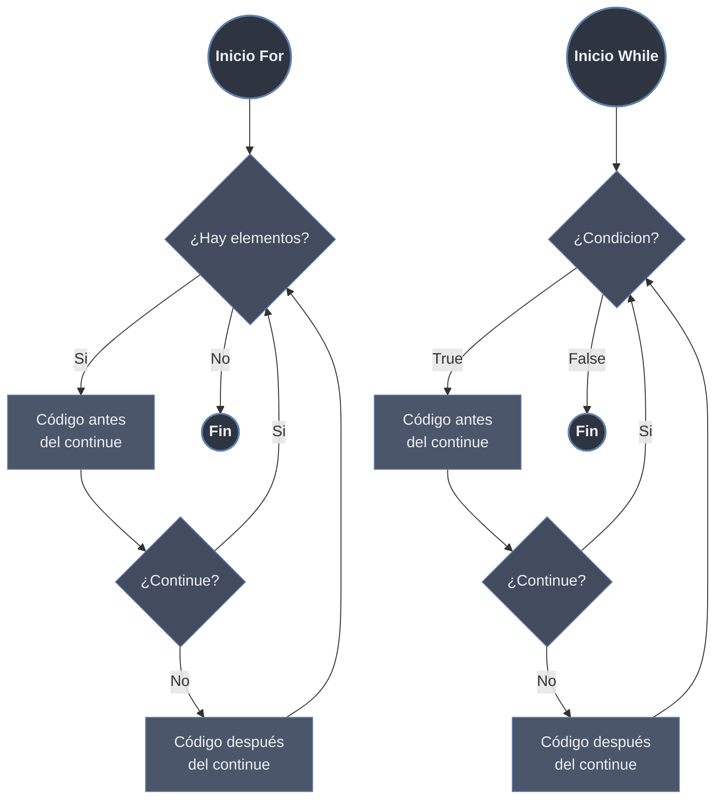

# Continue

`continue` salta el resto del código de la iteración actual y pasa inmediatamente a la siguiente iteración del [[32 Bucles/index | bucle]]. A diferencia de [[01 Break | break]], no termina el bucle: es el modificador de *control fino*, ideal para filtrar elementos sin abandonar la iteración completa.

## Sintaxis y Comportamiento
```python
# continue salta a la siguiente iteración
for elemento in iterable:
    # código antes
    if condición_para_omitir:
        continue  # Salta al siguiente elemento
    # código después (solo se ejecuta si NO se usó continue)

while condición:
    if condición_para_omitir:
        continue  # Salta a la siguiente evaluación
    # resto del código
```



> [!info] Qué salta exactamente
> `continue` descarta el resto del cuerpo del bucle, **no** salta el siguiente elemento. La iteración omitida no desaparece: simplemente no ejecuta las líneas posteriores al `continue`. El protocolo de avance del bucle (pedir el siguiente elemento en `for`, reevaluar la condición en `while`) ocurre igual.

## `continue` en `for`

En `for`, el avance al siguiente elemento lo gestiona el propio iterador, no tú. `continue` es seguro: siempre se pide el siguiente valor del iterable. No hay riesgo de bucle infinito.

```python
for n in range(6):
    if n % 2 == 0:
        continue        # omite los pares
    print(n)
# 1
# 3
# 5
```

El iterador interno avanza automáticamente; `continue` solo decide si se ejecuta el código que viene después.

## `continue` en `while` (cuidado con el contador)

> [!warning] Riesgo de bucle infinito
> En `while`, **tú** controlas la condición. Si la actualización del contador está *después* del `continue`, esa línea nunca se ejecuta en las iteraciones omitidas: la condición no cambia y el bucle se cuelga.

```python
# MAL: bucle infinito
i = 0
while i < 5:
    if i == 2:
        continue        # i nunca llega a incrementarse en i == 2
    print(i)
    i += 1              # inalcanzable cuando i == 2
# 0
# 1
# (se cuelga en i == 2 para siempre)
```

```python
# BIEN: incrementar ANTES del continue
i = 0
while i < 5:
    i += 1              # se actualiza siempre, pase lo que pase
    if i == 3:
        continue        # ya incrementado; el bucle avanza
    print(i)
# 1
# 2
# 4
# 5
```

Regla práctica: en `while` con `continue`, coloca toda actualización del estado que controla la condición **antes** del posible `continue`.

## Filtrar elementos: `continue` vs `if` envolvente

`continue` y un `if` que envuelve el cuerpo son funcionalmente equivalentes para filtrar. La elección es de legibilidad: `continue` aplica el patrón de **guarda temprana**, evitando anidamiento profundo cuando hay varias condiciones de descarte.

```python
# Con if envolvente: anidamiento que crece con cada condición
for x in datos:
    if isinstance(x, (int, float)):
        if x != 0:
            resultado.append(1 / x)

# Con continue: guardas planas, una por línea, fáciles de leer y ampliar
for x in datos:
    if not isinstance(x, (int, float)):
        continue
    if x == 0:
        continue
    resultado.append(1 / x)
```

| Criterio                  | `continue` (guarda)                  | `if` envolvente                    |
| ------------------------- | ------------------------------------ | ---------------------------------- |
| **Anidamiento**           | Plano (sin indentación extra)        | Crece con cada condición           |
| **Varias condiciones**    | Una guarda por condición, legible    | `if` anidados o `and` largos       |
| **Cuerpo principal**      | Al final, sin indentar               | Indentado dentro del `if`          |
| **Comprensiones**         | No se puede usar `continue`          | Se traduce a `if` en la comprensión |

> [!tip] Equivalencia con comprensiones
> Un filtro con `continue` corresponde a la cláusula `if` de una comprensión. `[x for x in datos if x > 0]` es la forma compacta de un `for`/`continue` que solo recolecta. Dentro de una comprensión **no** existe `continue`; el filtrado se expresa con `if`.

## Interacción con `else` del bucle

A diferencia de [[01 Break | break]], `continue` **no** afecta al bloque `else` del bucle. El `else` se ejecuta siempre que el bucle termine de forma natural (agotar el iterable o condición falsa), y `continue` no interrumpe esa terminación natural.

```python
for n in [1, 3, 5]:
    if n % 2 == 0:
        continue
    print(f"impar: {n}")
else:
    print("bucle completado sin break")
# impar: 1
# impar: 3
# impar: 5
# bucle completado sin break   <- el else SÍ se ejecuta
```

Solo [[01 Break | break]] suprime el `else`. Por muchos `continue` que se ejecuten, el `else` siempre corre al final.

## `continue` en bucles anidados

`continue` afecta **únicamente** al bucle más interno que lo contiene: salta a la siguiente iteración de ese bucle, dejando intacto el externo.

```python
for i in range(3):
    for j in range(3):
        if j == 1:
            continue        # salta solo la iteración del bucle de j
        print(f"({i},{j})")
# (0,0)
# (0,2)
# (1,0)
# (1,2)
# (2,0)
# (2,2)
```

Para "saltar" una iteración del bucle externo desde dentro del interno no existe un `continue` etiquetado en Python. Se usa una bandera, o se extrae el bucle interno a una función con `return`.

```python
# Patrón bandera: saltar fila externa según el contenido interno
matriz = [[1, 2, 3], [4, -1, 6], [7, 8, 9]]

for fila in matriz:
    tiene_negativo = any(v < 0 for v in fila)
    if tiene_negativo:
        continue            # salta toda la fila externa
    print(f"Fila válida: {fila}")
# Fila válida: [1, 2, 3]
# Fila válida: [7, 8, 9]
```

## `continue` vs `break` vs `pass`

Los tres aparecen en cuerpos de bucle pero hacen cosas distintas. `pass` no es un control de flujo: es un marcador de "no hacer nada".

| Aspecto                | `continue`                       | `break`                          | `pass`                              |
| ---------------------- | -------------------------------- | -------------------------------- | ----------------------------------- |
| **Efecto**             | Salta a la siguiente iteración   | Termina el bucle por completo    | No hace nada; sigue la línea siguiente |
| **El bucle sigue**     | Sí, con el resto de iteraciones  | No, sale inmediatamente          | Sí, ejecuta el resto del cuerpo     |
| **Salta código?**      | El resto de la iteración actual  | Todo lo que queda del bucle      | Nada                                |
| **Bloque `else`**      | Se ejecuta normalmente           | **No** se ejecuta                | Se ejecuta normalmente              |
| **Uso típico**         | Filtrar / omitir elementos       | Búsqueda y salida temprana       | Relleno de bloque vacío (sintaxis)  |
| **Fuera de bucle**     | `SyntaxError`                    | `SyntaxError`                    | Válido en cualquier bloque          |

```python
for n in range(4):
    if n == 1:
        pass            # placeholder: no altera el flujo, sigue abajo
    if n == 2:
        continue        # omite el print de n == 2
    if n == 3:
        break           # corta el bucle en n == 3
    print(n)
# 0
# 1                     <- pass no impidió el print
```

> [!note] `pass` no salta nada
> `pass` se usa cuando la sintaxis exige un bloque pero no quieres ejecutar lógica (un `if` que se rellenará luego, una clase/función vacía). No se parece a `continue`: el código posterior dentro de la iteración **sí** se ejecuta.

## Ejemplos Prácticos

### Procesar Solo Elementos Válidos
```python
# Ejemplo 1: Procesar solo números positivos
numeros = [5, -3, 0, 8, -1, 2]
total = 0

for num in numeros:
    if num <= 0:
        print(f"Omitiendo {num} (no es positivo)")
        continue  # Salta números no positivos
    
    # Solo llegamos aquí para números positivos
    cuadrado = num ** 2
    total += cuadrado
    print(f"Procesando {num}: cuadrado = {cuadrado}")

print(f"Suma de cuadrados positivos: {total}")
```

### Filtrar Datos Incompletos
```python
# Ejemplo 2: Procesar solo usuarios con email válido
usuarios = [
    {"nombre": "Ana", "email": "ana@example.com"},
    {"nombre": "Carlos", "email": ""},
    {"nombre": "Beatriz", "email": "beatriz@correo.com"},
    {"nombre": "David", "email": None},
]

print("Enviando emails a usuarios válidos:")
for usuario in usuarios:
    email = usuario.get("email")
    
    # Validar email
    if not email or "@" not in email:
        print(f"  Omitiendo {usuario['nombre']}: email inválido")
        continue
    
    # Solo para emails válidos
    print(f"  Enviando email a {usuario['nombre']} ({email})")
    # Aquí iría el código real de envío
```

### Saltar Iteraciones Específicas
```python
# Ejemplo 3: Procesar días de semana excepto fines de semana
dias = ["lunes", "martes", "miércoles", "jueves", "viernes", "sábado", "domingo"]

print("Días laborables:")
for dia in dias:
    if dia in ["sábado", "domingo"]:
        continue  # Saltamos fines de semana
    
    print(f"  {dia.capitalize()}: reunión de equipo")
    # Aquí irían las tareas laborales específicas
```

## Patrón: Filtrado Encadenado
```python
# Procesar solo elementos válidos
datos = [10, 0, 15, "texto", 20, None, 25]
suma = 0

for valor in datos:
    if not isinstance(valor, (int, float)):
        continue  # Salta no-números
    if valor == 0:
        continue  # Salta ceros
    
    suma += 1 / valor  # Solo para números no-cero

print(f"Suma de inversos válidos: {suma:.2f}")
```

> [!note] En bucles anidados
> Igual que `break`, `continue` solo afecta al bucle más interno: salta a la siguiente iteración de ese bucle, no del externo.
