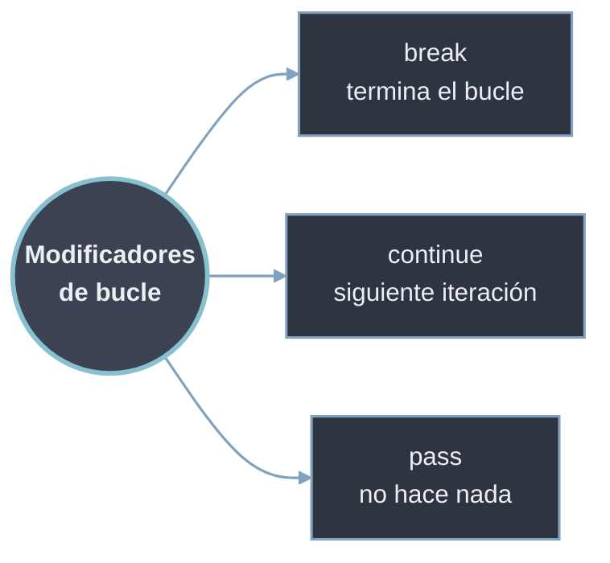

# Control de Flujo

`break`, `continue` y `pass` son palabras clave que modifican el comportamiento normal de los [[32 Bucles/index | bucles]]. Permiten un control más granular sobre la ejecución de las iteraciones: dos de ellas alteran el flujo (interrupción y control fino) y una es puramente sintáctica.

- [[01 Break | break]] — *interrupción*: termina el bucle más interno de inmediato, ignorando la condición restante. Para búsquedas y salidas tempranas.
- [[02 Continue | continue]] — *control fino*: salta a la siguiente iteración sin abandonar el bucle. Para filtrar u omitir elementos.
- [[03 Pass | pass]] — *operación nula*: no altera el flujo; rellena un bloque vacío para que el código compile (placeholder de desarrollo).

## Tabla Resumen

| Palabra clave        | Efecto sobre el bucle              | Uso típico                         | Afecta `else` del bucle |
| -------------------- | ---------------------------------- | ---------------------------------- | ----------------------- |
| [[01 Break \| break]]   | Lo termina por completo            | Búsqueda, salida temprana          | El `else` no se ejecuta |
| [[02 Continue \| continue]] | Salta a la siguiente iteración | Filtrado, omitir elementos         | El `else` se ejecuta    |
| [[03 Pass \| pass]]     | Ninguno (no hace nada)             | Placeholder, bloques vacíos        | Sin efecto              |



## Uso Combinado en Bucles Anidados

En bucles anidados, tanto [[01 Break | break]] como [[02 Continue | continue]] afectan **solo al bucle más interno**. Para controlar bucles externos se combinan banderas, varios `break` o el `else` de bucle.

### Procesamiento Selectivo en Estructuras Anidadas
```python
# Procesar estudiantes y sus calificaciones
estudiantes = {
    "Ana": [8, 7, 9],
    "Carlos": [4, 5, 3],  # Tiene una calificación baja
    "Beatriz": [9, 9, 8],
    "David": [6, 7, 5],
}

print("Analizando calificaciones:")
for estudiante, calificaciones in estudiantes.items():
    print(f"\n{estudiante}: {calificaciones}")
    
    # Verificar si hay alguna calificación reprobatoria (< 6)
    for calif in calificaciones:
        if calif < 6:
            print(f"  ¡Atención! {estudiante} tiene calificación {calif}")
            # Podríamos usar continue aquí si solo queremos marcar y seguir
            # O break si queremos detener el análisis de este estudiante
    
    # continue aquí afectaría solo al bucle externo
    # break aquí afectaría solo al bucle externo
```

### Combinación Compleja: break + continue + else
```python
# Sistema de procesamiento de pedidos
pedidos = [
    {"id": 1, "items": ["manzana", "banana"], "urgente": True},
    {"id": 2, "items": [], "urgente": False},  # Pedido vacío
    {"id": 3, "items": ["naranja"], "urgente": True},
    {"id": 4, "items": ["pera", "uva"], "urgente": False},
]

print("Procesando pedidos:")
for pedido in pedidos:
    # Usar continue para saltar pedidos vacíos
    if not pedido["items"]:
        print(f"  Saltando pedido {pedido['id']}: lista vacía")
        continue
    
    print(f"  Procesando pedido {pedido['id']}:")
    
    # Procesar cada item
    for item in pedido["items"]:
        # Simular error en procesamiento
        if item == "uva" and not pedido["urgente"]:
            print(f"    Error procesando '{item}' en pedido no urgente")
            # Podemos usar break para detener procesamiento de este pedido
            print(f"    Deteniendo procesamiento del pedido {pedido['id']}")
            break
        
        print(f"    Procesando: {item}")
    
    else:
        # Este else se ejecuta si NO se usó break en el bucle interno
        print(f"    Pedido {pedido['id']} completado exitosamente")
    
    # Si es urgente y hay error, podríamos querer detener todo
    if pedido["urgente"] and "uva" in pedido["items"]:
        print("  ¡Error en pedido urgente! Deteniendo sistema...")
        break  # Sale del bucle externo completamente

print("\nProcesamiento terminado.")
```

### Control Preciso con `continue` + `break` + `else`
```python
# Juego de búsqueda en tablero
tablero = [
    ['.', '.', 'X', '.'],
    ['.', 'O', '.', '.'],
    ['.', '.', '.', 'X'],
    ['O', '.', '.', '.']
]

# Buscar primer 'X' pero omitir filas que comienzan con 'O'
for i, fila in enumerate(tablero):
    if fila[0] == 'O':  # Si la fila empieza con O
        print(f"Saltando fila {i} (comienza con O)")
        continue
    
    for j, celda in enumerate(fila):
        if celda == 'X':
            print(f"¡Encontrado X en ({i},{j})!")
            # break aquí solo sale del bucle interno
            break
    else:
        # Se ejecuta si no se encontró X en esta fila
        continue
    
    # break aquí sale del bucle externo después de encontrar
    break
```

## Reglas y Consideraciones Importantes

1. **`break` solo afecta al bucle más interno**
   - En bucles anidados, `break` solo sale del bucle actual.
   - Use una bandera para salir de múltiples bucles.

2. **`continue` salta a la siguiente iteración**
   - No termina el bucle, solo la iteración actual.
   - Útil para filtrar elementos sin procesar.

3. **`pass` es para sintaxis, no para lógica**
   - No confundir con comentarios.
   - Úselo como placeholder temporal.

4. **`else` en bucles se ejecuta si no hubo `break`**
   - El `else` no se ejecuta si el bucle termina con `break`.

5. **Evite usar `pass` en producción**
   - Reemplace `pass` con implementación real.
   - Use `pass` solo durante desarrollo.

## Ejemplo Final Integrado

```python
def analizar_ventas(ventas, umbral_alto=1000, umbral_bajo=100):
    """
    Analiza ventas usando break, continue y pass estratégicamente
    """
    total = 0
    ventas_altas = 0
    primera_venta_baja = None
    
    print("=== ANÁLISIS DE VENTAS ===")
    
    for i, venta in enumerate(ventas, 1):
        # Validación básica con continue
        if venta is None:
            print(f"Venta {i}: Datos faltantes - OMITIDA")
            continue
        
        if not isinstance(venta, (int, float)):
            print(f"Venta {i}: Tipo inválido {type(venta)} - OMITIDA")
            continue
        
        # Procesamiento normal
        print(f"Venta {i}: ${venta:.2f}")
        total += venta
        
        # Identificar ventas altas
        if venta >= umbral_alto:
            ventas_altas += 1
            print(f"  ¡VENTA ALTA! (>${umbral_alto})")
        
        # Encontrar primera venta baja con break
        if venta < umbral_bajo and primera_venta_baja is None:
            primera_venta_baja = (i, venta)
            print(f"  Primera venta baja encontrada en posición {i}")
            # Podríamos usar break aquí si solo quisiéramos la primera
        
        # Placeholder para análisis futuro
        if 500 <= venta < 800:
            pass  # TODO: análisis especial para rango medio-alto
    
    # Resultados
    print(f"\n=== RESUMEN ===")
    print(f"Total ventas: ${total:.2f}")
    print(f"Ventas altas (>${umbral_alto}): {ventas_altas}")
    
    if primera_venta_baja:
        print(f"Primera venta baja (<${umbral_bajo}): posición {primera_venta_baja[0]}, ${primera_venta_baja[1]:.2f}")
    else:
        print("No se encontraron ventas bajas")

# Datos de prueba
ventas_mes = [1200, 850, None, 95, 450, "error", 1100, 75, 1500, 200]

# Ejecutar análisis
analizar_ventas(ventas_mes)
```
