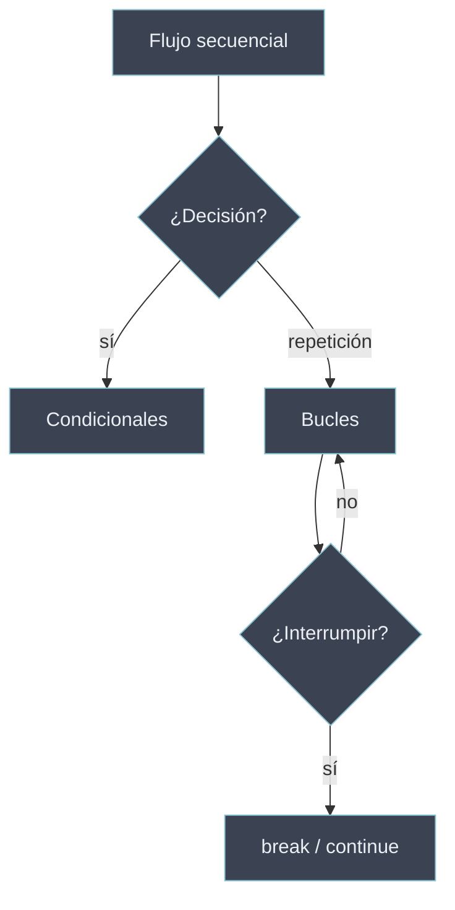

# Estructuras de Control

Construcciones que alteran la ejecución **secuencial** por defecto del programa. Sin ellas el código corre una vez de arriba abajo; con ellas se **decide** qué bloque ejecutar, se **repite** un bloque y se **interrumpe** el flujo interno. En Python el bloque se delimita por **indentación**, no por llaves.

Las condiciones que gobiernan estas estructuras se evalúan según los [[Valores Truthy y Falsy | valores de verdad]]: cualquier objeto, no solo `True`/`False`, vale como condición.

## Subtemas

- [[31 Condicionales/index | Condicionales]] — ejecución selectiva: `if`/`elif`/`else`, operador ternario y `match`/`case` (Python 3.10+).
- [[32 Bucles/index | Bucles]] — repetición: `while` (indefinido), `for` sobre iterables y comprensiones.
- [[33 Control de Flujo/index | Control de Flujo]] — modificadores dentro de los bucles: `break`, `continue` y `pass`.

## Mapa de decisión

| Pregunta | Estructura | Subtema |
| -------- | ---------- | ------- |
| ¿Ejecuto esto o no? | `if` / `elif` / `else`, ternario, `match` | [[31 Condicionales/index \| Condicionales]] |
| ¿Cuántas veces lo ejecuto? | `while`, `for` | [[32 Bucles/index \| Bucles]] |
| ¿Altero el bloque en curso? | `break`, `continue`, `pass` | [[33 Control de Flujo/index \| Control de Flujo]] |

Estas estructuras operan sobre los [[10 Variables y Tipos de Datos/index | tipos]] y recorren las [[20 Estructura de Datos/index | colecciones]]; cuando un bloque se encapsula y se reutiliza, se convierte en una [[40 Funciones/index | función]].
