# Definición y Llamada de Funciones

Una **función** es un bloque de código reutilizable que realiza una tarea específica. Se define con `def`, un nombre en `snake_case`, una lista de parámetros y un cuerpo indentado; se ejecuta al **llamarla** con `nombre(argumentos)`. La estructura básica —firma, parámetros, retorno— se reparte en las tres hojas de esta carpeta.

```mermaid
flowchart LR
    classDef principal fill:#2e3440,stroke:#5e81ac,stroke-width:2px,color:#eceff4,font-weight:bold;
    classDef categoria fill:#434c5e,stroke:#5e81ac,stroke-width:1px,color:#eceff4,font-weight:bold;
    classDef tipo fill:#4c566a,stroke:#5e81ac,stroke-width:1px,color:#eceff4;

    A((Funciones en Python)):::principal

    A --> B[Definición Básica]:::categoria
    A --> C[Llamada/Invocación]:::categoria
    A --> D[Parámetros y Argumentos]:::categoria
    A --> E[Valores de Retorno]:::categoria

    subgraph G1 [ ]
        B --> B1["def nombre():"]:::tipo
        B --> B2[Cuerpo indentado]:::tipo
        B --> B3[Docstrings]:::tipo
        B --> B4[Pass para esqueleto]:::tipo
    end

    subgraph G2 [ ]
        C --> C1["nombre()"]:::tipo
        C --> C2[Con argumentos]:::tipo
        C --> C3[En expresiones]:::tipo
        C --> C4[Como argumento]:::tipo
    end

    subgraph G3 [ ]
        D --> D1[Posicionales]:::tipo
        D --> D2[Nombrados]:::tipo
        D --> D3[Por defecto]:::tipo
        D --> D4[Variables *args]:::tipo
        D --> D5[Variables **kwargs]:::tipo
        D --> D6[Solo posicionales /]:::tipo
        D --> D7[Solo nombrados *]:::tipo
    end

    subgraph G4 [ ]
        E --> E1["return valor"]:::tipo
        E --> E2["return múltiple"]:::tipo
        E --> E3["return None"]:::tipo
        E --> E4[Sin return]:::tipo
    end

    style G1 fill:#3b4252,stroke:#5e81ac,stroke-dasharray:5 5
    style G2 fill:#3b4252,stroke:#5e81ac,stroke-dasharray:5 5
    style G3 fill:#3b4252,stroke:#5e81ac,stroke-dasharray:5 5
    style G4 fill:#3b4252,stroke:#5e81ac,stroke-dasharray:5 5
```

## Hojas

- [[01 Sintaxis Basica | Sintaxis Básica]] — definición con `def`, cuerpo indentado, `pass` como esqueleto, docstring, llamada/invocación y nomenclatura PEP 8 (`snake_case`).
- [[02 Parametros y Argumentos | Parámetros y Argumentos]] — posicionales, nombrados, valores por defecto, `*args`/`**kwargs`, marcadores `/` y `*`, y el paso por asignación (mutabilidad y efectos secundarios).
- [[03 Valor de Retorno | Valor de Retorno]] — `return`, retorno múltiple como tupla implícita, `None` implícito, *early return* y closures.

## Tabla Resumen de Sintaxis

| Concepto | Sintaxis | Ejemplo | Hoja |
|----------|----------|---------|------|
| Definición básica | `def nombre():` | `def saludar():` | [[01 Sintaxis Basica \| Sintaxis Básica]] |
| Con parámetros | `def nombre(param):` | `def suma(a, b):` | [[01 Sintaxis Basica \| Sintaxis Básica]] |
| Con docstring | `"""documentación"""` | `def func(): """docs"""` | [[01 Sintaxis Basica \| Sintaxis Básica]] |
| Llamada | `nombre()` | `saludar()` | [[01 Sintaxis Basica \| Sintaxis Básica]] |
| Return | `return valor` | `return a + b` | [[03 Valor de Retorno \| Valor de Retorno]] |
| Return múltiple | `return a, b, c` | `return x, y` | [[03 Valor de Retorno \| Valor de Retorno]] |
| Parámetros por defecto | `def f(a, b=5):` | `def potencia(x, exp=2):` | [[02 Parametros y Argumentos \| Parámetros y Argumentos]] |
| `*args` | `def f(*args):` | `def suma(*nums):` | [[02 Parametros y Argumentos \| Parámetros y Argumentos]] |
| `**kwargs` | `def f(**kwargs):` | `def config(**opts):` | [[02 Parametros y Argumentos \| Parámetros y Argumentos]] |
| Solo posicional | `def f(a, b, /):` | `def division(a, b, /):` | [[02 Parametros y Argumentos \| Parámetros y Argumentos]] |
| Solo nombrado | `def f(*, a, b):` | `def config(*, host):` | [[02 Parametros y Argumentos \| Parámetros y Argumentos]] |
