# Clasificación de Funciones

Las funciones de Python se clasifican según tres ejes: su **origen** (incorporadas vs. definidas por el usuario), su **estructura sintáctica** (`def` completo, `lambda` de una expresión, anidamiento) y su **comportamiento de ejecución** (retorno directo, autollamada recursiva, suspensión perezosa con `yield`, captura de estado, envoltura de otras funciones). Una misma función puede pertenecer a varias categorías a la vez.

## Subtemas

- [[01 Funciones Built-in | Built-in]] — incorporadas al intérprete: `print`/`len`/`type`, `abs`/`round`/`sum`, conversores `int`/`str`/`list`; siempre disponibles sin importar.
- [[02 Funciones de Usuario | De usuario]] — definidas con `def`: parámetros, retorno, anidamiento y funciones como objetos de primera clase.
- [[03 Funciones Lambda | Lambda]] — anónimas de una sola expresión `lambda args: expr`; usadas como `key`/callback en `sorted`/`map`/`filter`.
- [[04 Funciones Recursivas | Recursivas]] — se llaman a sí mismas; caso base/recursivo, factorial/fibonacci, memoización y límite de pila.
- [[05 Funciones Generadoras | Generadoras]] — `yield` en vez de `return`: evaluación perezosa, estado suspendido, expresiones generadoras.
- [[06 Decoradores | Decoradores]] — envuelven otra función con un `wrapper` y la sintaxis `@`; `functools.wraps`, decoradores con argumentos, `@property`/`@classmethod`/`@staticmethod`.
- [[07 Funciones de Orden Superior | Orden superior]] — reciben o retornan funciones; `map`/`filter`/`reduce`.
- [[08 Closures | Closures]] — función anidada que captura el ámbito envolvente; `nonlocal`, estado persistente, fábricas de funciones.

## Clasificación

| Tipo | Sintaxis | Uso Típico | Ventajas | Desventajas |
|------|----------|------------|----------|-------------|
| [[01 Funciones Built-in \| Built-in]] | `print()`, `len()` | Operaciones comunes | Rápidas, probadas, siempre disponibles | Limitadas a lo que ofrece Python |
| [[02 Funciones de Usuario \| Usuario]] | `def nombre():` | Lógica de negocio personalizada | Flexibilidad total, reutilizable | Requiere implementación manual |
| [[03 Funciones Lambda \| Lambda]] | `lambda x: x**2` | Operaciones simples, callbacks | Concisa, anónima | Solo una expresión, menos legible |
| [[04 Funciones Recursivas \| Recursiva]] | `def f(): f()` | Estructuras jerárquicas (árboles) | Elegante para problemas recursivos | Puede ser ineficiente, límite de pila |
| [[05 Funciones Generadoras \| Generadora]] | `def f(): yield x` | Flujos grandes/infinitos, lazy | Bajo consumo de memoria, perezosa | Un solo recorrido, sin indexar ni `len()` |
| [[06 Decoradores \| Decorador]] | `@deco def f():` | Extender comportamiento (log, timing) | Reutilizable, no invasivo | Indirección, requiere `functools.wraps` |
| [[07 Funciones de Orden Superior \| Orden superior]] | `map(f, it)` | Transformar/filtrar/acumular | Composición, código declarativo | Comprehensions suelen ser más legibles |
| [[08 Closures \| Closure]] | `def out(): def in(): ...` | Estado encapsulado, fábricas | Estado privado persistente | Estado oculto puede dificultar el rastreo |

```mermaid
flowchart LR
    classDef principal fill:#2e3440,stroke:#5e81ac,stroke-width:2px,color:#eceff4,font-weight:bold;
    classDef categoria fill:#434c5e,stroke:#5e81ac,stroke-width:1px,color:#eceff4,font-weight:bold;
    classDef tipo fill:#4c566a,stroke:#5e81ac,stroke-width:1px,color:#eceff4;

    A((Clasificación de Funciones)):::principal

    A --> B[Funciones Built-in]:::categoria
    A --> C[Funciones de Usuario]:::categoria
    A --> D[Funciones Lambda]:::categoria
    A --> E[Funciones Recursivas]:::categoria
    A --> F[Funciones Generadoras]:::categoria
    A --> H[Orden Superior HOF]:::categoria
    A --> I[Closures]:::categoria
    A --> J[Decoradores]:::categoria

    subgraph G1 [ ]
        B --> B1[I/O: print, input]:::tipo
        B --> B2[Tipo: int, str, list]:::tipo
        B --> B3[Matemáticas: abs, sum, round]:::tipo
        B --> B4[Iterables: len, range, enumerate]:::tipo
        B --> B5[Utilitarias: help, dir, id]:::tipo
    end

    subgraph G2 [ ]
        C --> C1["def nombre():"]:::tipo
        C --> C2[Con/sin parámetros]:::tipo
        C --> C3[Con/sin retorno]:::tipo
        C --> C4[Anidadas]:::tipo
        C --> C5[Como objetos]:::tipo
    end

    subgraph G3 [ ]
        D --> D1["lambda args: expresión"]:::tipo
        D --> D2[Anónimas]:::tipo
        D --> D3[Una línea]:::tipo
        D --> D4[Usos: sorted, map, filter]:::tipo
    end

    subgraph G4 [ ]
        E --> E1[Se llama a sí misma]:::tipo
        E --> E2[Caso base]:::tipo
        E --> E3[Caso recursivo]:::tipo
        E --> E4[Pila de llamadas]:::tipo
        E --> E5[Ejemplos: factorial, fibonacci]:::tipo
    end

    subgraph G5 [ ]
        F --> F1["yield"]:::tipo
        F --> F2[Evaluación perezosa]:::tipo
        F --> F3[Estado suspendido]:::tipo
        F --> F4["next() / for"]:::tipo
        F --> F5["expr generadoras"]:::tipo
    end

    subgraph G6 [ ]
        H --> H1["map / filter / reduce"]:::tipo
        H --> H2[Reciben funciones]:::tipo
        H --> H3[Retornan funciones]:::tipo
    end

    subgraph G7 [ ]
        I --> I1[Captura ámbito envolvente]:::tipo
        I --> I2[Estado persistente]:::tipo
        I --> I3["nonlocal"]:::tipo
    end

    subgraph G8 [ ]
        J --> J1["@decorador"]:::tipo
        J --> J2["wrapper(*args, **kwargs)"]:::tipo
        J --> J3["functools.wraps"]:::tipo
        J --> J4["@property, @classmethod"]:::tipo
    end

    style G1 fill:#3b4252,stroke:#5e81ac,stroke-dasharray:5 5
    style G2 fill:#3b4252,stroke:#5e81ac,stroke-dasharray:5 5
    style G3 fill:#3b4252,stroke:#5e81ac,stroke-dasharray:5 5
    style G4 fill:#3b4252,stroke:#5e81ac,stroke-dasharray:5 5
    style G5 fill:#3b4252,stroke:#5e81ac,stroke-dasharray:5 5
    style G6 fill:#3b4252,stroke:#5e81ac,stroke-dasharray:5 5
    style G7 fill:#3b4252,stroke:#5e81ac,stroke-dasharray:5 5
    style G8 fill:#3b4252,stroke:#5e81ac,stroke-dasharray:5 5

```

Las [[03 Funciones Lambda | lambdas]] son el insumo habitual de las [[07 Funciones de Orden Superior | funciones de orden superior]] (`map`/`filter`/`reduce`), y tanto [[08 Closures | closures]] como [[06 Decoradores | decoradores]] se construyen sobre funciones anidadas que capturan su entorno. La mecánica de captura de variables se rige por las reglas de [[index | Ámbito y Espacios de Nombres]].
