# Ámbito y Espacios de Nombres

> [!definicion]
> El **ámbito** (*scope*) de un nombre es la región textual del código donde ese nombre es directamente accesible. Un **espacio de nombres** (*namespace*) es la tabla que asocia nombres con objetos para un ámbito dado. Python mantiene espacios de nombres anidados —local, enclosing, global y built-in— y resuelve cada referencia recorriéndolos en ese orden.

El ámbito determina además el **tiempo de vida** del nombre: las variables locales nacen y mueren con cada llamada a la función, mientras que las globales persisten durante toda la ejecución del módulo.

```mermaid
flowchart LR
    classDef principal fill:#2e3440,stroke:#5e81ac,stroke-width:2px,color:#eceff4,font-weight:bold;
    classDef categoria fill:#434c5e,stroke:#5e81ac,stroke-width:1px,color:#eceff4,font-weight:bold;
    classDef tipo fill:#4c566a,stroke:#5e81ac,stroke-width:1px,color:#eceff4;

    A[Ámbito y Espacios de Nombres]:::principal

    A --> B[Variables Locales vs Globales]:::categoria
    A --> C[Regla LEGB]:::categoria
    A --> D[Palabra clave global]:::categoria
    A --> E[Palabra clave nonlocal]:::categoria

    subgraph G1 [ ]
        B --> B1[Locales: dentro de función]:::tipo
        B --> B2[Globales: a nivel de módulo]:::tipo
        B --> B3[Tiempo de vida diferente]:::tipo
        B --> B4[Acceso vs Modificación]:::tipo
    end

    subgraph G2 [ ]
        C --> C1[L - Local]:::tipo
        C --> C2[E - Enclosing]:::tipo
        C --> C3[G - Global]:::tipo
        C --> C4[B - Built-in]:::tipo
    end

    subgraph G3 [ ]
        D --> D1[Declarar variable global]:::tipo
        D --> D2[Modificar global desde función]:::tipo
        D --> D3[Crear global desde función]:::tipo
    end

    subgraph G4 [ ]
        E --> E1[Funciones anidadas]:::tipo
        E --> E2[Modificar enclosing scope]:::tipo
        E --> E3[Closures y nonlocal]:::tipo
    end

    style G1 fill:#3b4252,stroke:#5e81ac,stroke-dasharray:5 5
    style G2 fill:#3b4252,stroke:#5e81ac,stroke-dasharray:5 5
    style G3 fill:#3b4252,stroke:#5e81ac,stroke-dasharray:5 5
    style G4 fill:#3b4252,stroke:#5e81ac,stroke-dasharray:5 5
```

---

## Subtemas

- [[01 Variables Locales | Variables Locales]] — nombres creados dentro de una función, accesibles solo durante su ejecución, que ocultan a las globales homónimas.
- [[02 Variables Globales | Variables Globales]] — nombres a nivel de módulo: lectura directa, modificación con `global`, y por qué el estado global es problemático.
- [[03 Regla LEGB | Regla LEGB]] — orden de resolución de nombres Local → Enclosing → Global → Built-in, con ejemplos de cada nivel.
- [[04 Nonlocal | Nonlocal]] — escritura sobre el ámbito enclosing en funciones anidadas y su rol en los [[08 Closures | closures]].

---

## Tabla resumen

| Concepto | Alcance | Modificación | Palabra clave | Ejemplo |
|:---|:---|:---|:---|:---|
| **Local** | Dentro de función | Directa | — | `x = 5` |
| **Global** | Todo el módulo | Lectura directa, modificación con `global` | `global` | `global x; x = 5` |
| **Enclosing** | Función contenedora | Lectura directa, modificación con `nonlocal` | `nonlocal` | `nonlocal x; x = 5` |
| **Built-in** | Todo Python | No modificable | — | `len()`, `print()` |

> [!regla]
> **Lectura** de un nombre: sigue la [[03 Regla LEGB | regla LEGB]] de adentro hacia afuera. **Escritura** de un nombre: crea Local por defecto; alcanzar el nivel Global exige [[02 Variables Globales | global]] y el nivel Enclosing exige [[04 Nonlocal | nonlocal]].
