# Patrones de Argumentos

La firma de una función define **cuántos** argumentos acepta y **cómo** se pasan: por **posición** o por **nombre**, con o sin **valor por defecto**, en cantidad **fija** o **variable**. Los marcadores `/` y `*` restringen la forma de paso; `*args`/`**kwargs` la abren a un número arbitrario. Dominar estos patrones permite escribir llamadas legibles y APIs estables.

```mermaid
flowchart LR
    classDef principal fill:#2e3440,stroke:#5e81ac,stroke-width:2px,color:#eceff4,font-weight:bold;
    classDef categoria fill:#434c5e,stroke:#5e81ac,stroke-width:1px,color:#eceff4,font-weight:bold;
    classDef tipo fill:#4c566a,stroke:#5e81ac,stroke-width:1px,color:#eceff4;

    A[Patrones de Argumentos]:::principal

    A --> B[Posicionales y Nominales]:::categoria
    A --> C[Valores por Defecto]:::categoria
    A --> D[*args y **kwargs]:::categoria
    A --> E[Solo Posicionales /]:::categoria
    A --> F[Solo Nominales *]:::categoria

    subgraph G1 [ ]
        B --> B1["Por posición: func(1, 2, 3)"]:::tipo
        B --> B2["Por nombre: func(a=1, b=2)"]:::tipo
        B --> B3[Mezcla: posicionales + nominales]:::tipo
    end

    subgraph G2 [ ]
        C --> C1["def func(a, b=5)"]:::tipo
        C --> C2[Parámetros opcionales]:::tipo
        C --> C3[Orden: sin defecto → con defecto]:::tipo
    end

    subgraph G3 [ ]
        D --> D1[*args - tupla de posicionales]:::tipo
        D --> D2[**kwargs - dict de nominales]:::tipo
        D --> D3[Combinación: *args, **kwargs]:::tipo
        D --> D4[Desempaquetado con * y **]:::tipo
    end

    subgraph G4 [ ]
        E --> E1[Parámetros antes de /]:::tipo
        E --> E2[No pueden ser por nombre]:::tipo
        E --> E3["def func(a, b, /, c)"]:::tipo
    end

    subgraph G5 [ ]
        F --> F1[Parámetros después de *]:::tipo
        F --> F2[Deben ser por nombre]:::tipo
        F --> F3["def func(*, a, b)"]:::tipo
    end

    style G1 fill:#3b4252,stroke:#5e81ac,stroke-dasharray:5 5
    style G2 fill:#3b4252,stroke:#5e81ac,stroke-dasharray:5 5
    style G3 fill:#3b4252,stroke:#5e81ac,stroke-dasharray:5 5
    style G4 fill:#3b4252,stroke:#5e81ac,stroke-dasharray:5 5
    style G5 fill:#3b4252,stroke:#5e81ac,stroke-dasharray:5 5

```

## Subtemas

- [[01 Args y Kwargs | Args y Kwargs]] — aridad variable: `*args` (posicionales en tupla), `**kwargs` (nominales en dict), desempaquetado con `*`/`**` en la llamada y convenciones de uso.
- [[02 Argumentos por Defecto | Argumentos por Defecto]] — parámetros opcionales: evaluación del defecto en tiempo de definición y el peligro de los mutables como valor por omisión.
- [[03 Posicionales vs Nominales | Posicionales vs Nominales]] — paso por posición o por nombre y su restricción con `/` (solo-posicional) y `*` (solo-nominal) para diseñar APIs claras.

## Tabla Resumen de Patrones

| Patrón | Sintaxis | Uso | Ejemplo | Nota |
| ------ | -------- | --- | ------- | ---- |
| **Posicional** | `def f(a, b):` | Orden importa | `f(1, 2)` | [[03 Posicionales vs Nominales \| Posicionales vs Nominales]] |
| **Nominal** | `def f(a, b):` | Orden no importa | `f(b=2, a=1)` | [[03 Posicionales vs Nominales \| Posicionales vs Nominales]] |
| **Valor por defecto** | `def f(a, b=5):` | Parámetros opcionales | `f(1)`, `f(1, 2)` | [[02 Argumentos por Defecto \| Argumentos por Defecto]] |
| **`*args`** | `def f(*args):` | Variable posicionales | `f(1,2,3)` | [[01 Args y Kwargs \| Args y Kwargs]] |
| **`**kwargs`** | `def f(**kwargs):` | Variable nominales | `f(x=1, y=2)` | [[01 Args y Kwargs \| Args y Kwargs]] |
| **Solo posicional** | `def f(a, b, /):` | Forzar posicionales | `f(1, 2)` | [[03 Posicionales vs Nominales \| Posicionales vs Nominales]] |
| **Solo nominal** | `def f(*, a, b):` | Forzar nominales | `f(a=1, b=2)` | [[03 Posicionales vs Nominales \| Posicionales vs Nominales]] |

El orden canónico completo de una firma es: `pos_only, /, pos_o_nom=def, *args, kw_only=def, **kwargs`. Estos patrones se aplican sobre la [[41 Definicion y Llamada/index | definición y llamada]] de funciones y sustentan el reenvío genérico de los decoradores.
