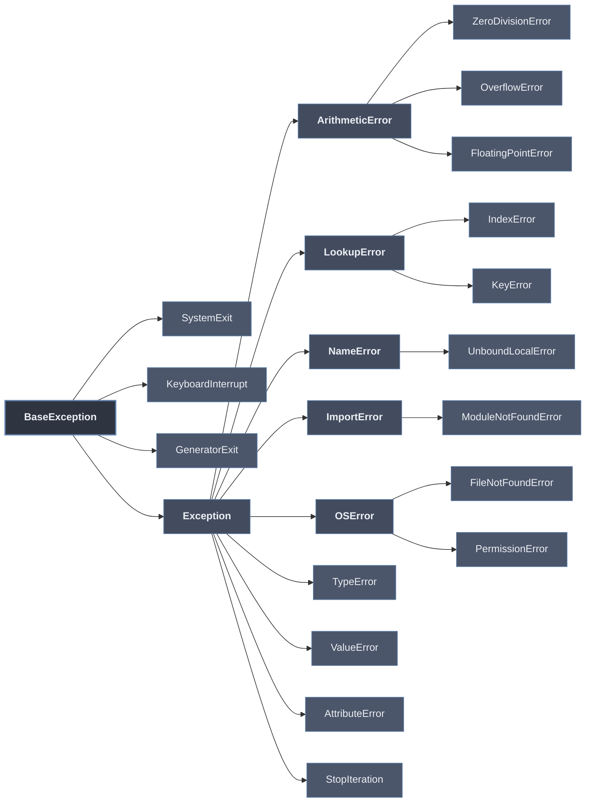

# Jerarquía de Excepciones

Toda excepción en Python hereda de `BaseException`. La jerarquía organiza los errores en un árbol de clases, de modo que `except` captura una excepción **y todas sus subclases**: capturar la raíz adecuada determina si el manejo es específico o general.

`BaseException` tiene dos ramas relevantes:

- **`Exception`** — base de los errores **controlables** del programa (los que normalmente se capturan: `TypeError`, `ValueError`, `LookupError`, `OSError`, …).
- **Excepciones del sistema** que cuelgan directamente de `BaseException` (`SystemExit`, `KeyboardInterrupt`, `GeneratorExit`): señales de control de flujo del intérprete que **no** deben quedar atrapadas por un `except Exception`.

```python
try:
    resultado = 10 / 0
except ZeroDivisionError:     # captura la subclase concreta
    ...
except ArithmeticError:       # capturaría a cualquier hija de ArithmeticError
    ...
except Exception:             # cualquier error controlable
    ...
```

## El árbol de jerarquía



## Jerarquía completa anotada

```python
# Jerarquía simplificada de excepciones
def mostrar_jerarquia_excepciones():
    """Muestra la jerarquía de excepciones más importante."""
    
    jerarquia = {
        "BaseException": {
            "SystemExit": "Lanzada por sys.exit()",
            "KeyboardInterrupt": "Lanzada por Ctrl+C",
            "GeneratorExit": "Lanzada cuando un generador cierra",
            "Exception": {
                "StopIteration": "Fin de iteración",
                "ArithmeticError": {
                    "ZeroDivisionError": "División por cero",
                    "OverflowError": "Resultado demasiado grande",
                    "FloatingPointError": "Error en punto flotante"
                },
                "LookupError": {
                    "IndexError": "Índice fuera de rango",
                    "KeyError": "Clave no encontrada"
                },
                "NameError": {
                    "UnboundLocalError": "Variable local sin referencia"
                },
                "TypeError": "Operación en tipo incorrecto",
                "ValueError": "Valor incorrecto",
                "ImportError": {
                    "ModuleNotFoundError": "Módulo no encontrado"
                },
                "AttributeError": "Atributo no existe",
                "FileNotFoundError": "Archivo no encontrado",
                "PermissionError": "Permiso denegado",
                "OSError": "Error del sistema operativo"
            }
        }
    }
    
    def print_jerarquia(diccionario, nivel=0):
        indent = "  " * nivel
        for nombre, valor in diccionario.items():
            if isinstance(valor, dict):
                print(f"{indent}├─ {nombre}")
                print_jerarquia(valor, nivel + 1)
            else:
                print(f"{indent}├─ {nombre}: {valor}")
    
    print("Jerarquía de Excepciones en Python:")
    print_jerarquia(jerarquia)

mostrar_jerarquia_excepciones()
```

## Captura específica frente a general

Cada bloque `except` captura la clase indicada y cualquier descendiente. Una misma excepción (`ZeroDivisionError`) es atrapada por cualquiera de sus ancestros:

```python
# La jerarquía permite capturar excepciones específicas o generales
def demostrar_jerarquia():
    """Muestra cómo la jerarquía afecta la captura de excepciones."""
    
    try:
        resultado = 10 / 0  # ZeroDivisionError
    except ZeroDivisionError:
        print("1. Capturado ZeroDivisionError específicamente")
    
    try:
        resultado = 10 / 0
    except ArithmeticError:  # Padre de ZeroDivisionError
        print("2. Capturado ArithmeticError (general)")
    
    try:
        resultado = 10 / 0
    except Exception:  # Aún más general
        print("3. Capturado Exception (muy general)")
    
    try:
        resultado = 10 / 0
    except BaseException:  # El más general (no recomendado)
        print("4. Capturado BaseException (demasiado general)")
    
    print("\n⚠️ Nota: Capturar excepciones muy generales puede ocultar errores")

demostrar_jerarquia()
```

> [!warning] No capturar la raíz sin razón
> Un `except Exception` (o peor, `except BaseException`) atrapa errores no previstos y oculta bugs. `BaseException` además captura `KeyboardInterrupt` y `SystemExit`, impidiendo que `Ctrl+C` o `sys.exit()` terminen el programa. Capturar siempre la clase **más específica** que se sepa manejar.

## Excepciones del sistema

Cuelgan directamente de `BaseException`, **fuera** de `Exception`, precisamente para que `except Exception` no las intercepte:

| Excepción | Origen | Significado |
|-----------|--------|-------------|
| `SystemExit` | `sys.exit()` | Solicitud ordenada de terminar el intérprete. |
| `KeyboardInterrupt` | `Ctrl+C` (SIGINT) | Interrupción manual del usuario. |
| `GeneratorExit` | Cierre de un generador | El generador es cerrado (`.close()` o recolección). |

Estas señales son control de flujo del intérprete, no errores de lógica; deben propagarse salvo que exista una razón explícita para interceptarlas (p. ej. limpieza antes de salir).

## Verificación de herencia

`issubclass` y el atributo `__mro__` (orden de resolución de métodos) permiten inspeccionar las relaciones en tiempo de ejecución:

```python
# Verificar relaciones de herencia
def verificar_herencia():
    """Comprueba relaciones de herencia entre excepciones."""
    
    excepciones = [
        (ZeroDivisionError, ArithmeticError),
        (ArithmeticError, Exception),
        (Exception, BaseException),
        (KeyError, LookupError),
        (LookupError, Exception),
        (ModuleNotFoundError, ImportError),
        (ImportError, Exception),
        (FileNotFoundError, OSError),
        (OSError, Exception)
    ]
    
    for hijo, padre in excepciones:
        es_subclase = issubclass(hijo, padre)
        print(f"¿{hijo.__name__} es subclase de {padre.__name__}? {es_subclase}")
    
    print("\nMRO de ZeroDivisionError:")
    print(ZeroDivisionError.__mro__)

verificar_herencia()
```

El orden de los bloques `except` debe ir **de lo específico a lo general**: si `Exception` se sitúa antes que `ZeroDivisionError`, el segundo nunca se alcanza, porque el primero ya captura toda la rama.

El detalle de cada hoja del árbol se desarrolla en [[02 Excepciones Comunes | Excepciones Comunes]] y su clasificación por categoría en [[03 Excepciones por Tipo | Excepciones por Tipo]].
