# Excepciones Built-in

Una **excepción** es un objeto que Python eleva cuando una operación no puede completarse: detiene el flujo normal y propaga el error hacia arriba hasta que un `except` lo captura o el programa termina. Las **built-in** son las excepciones predefinidas del lenguaje (`TypeError`, `ValueError`, `KeyError`, `OSError`, …), todas descendientes de `BaseException` y organizadas en un árbol de herencia.

Interpretar una excepción consiste en leer dos datos: su **tipo** (qué clase de fallo es) y su **mensaje** (el detalle concreto). El tipo ubica el error en la jerarquía y dice qué clase base puede capturarlo; el mensaje señala el valor o nombre culpable.

```python
try:
    numero = int("hola")
except ValueError as e:      # tipo: ValueError
    print(e)                 # mensaje: invalid literal for int() with base 10: 'hola'
```

```mermaid
flowchart LR
    classDef principal fill:#2e3440,stroke:#5e81ac,stroke-width:2px,color:#eceff4,font-weight:bold;
    classDef categoria fill:#434c5e,stroke:#5e81ac,stroke-width:1px,color:#eceff4,font-weight:bold;
    classDef tipo fill:#4c566a,stroke:#5e81ac,stroke-width:1px,color:#eceff4;

    A[Excepciones Built-in]:::principal

    A --> B[Jerarquía Base]:::categoria
    A --> C[Excepciones Comunes]:::categoria
    A --> D[Categorías de Errores]:::categoria

    subgraph G1 [ ]
        B --> B1[BaseException]:::tipo
        B1 --> B2[Exception]:::tipo
        B2 --> B3[Errores de Programa]:::tipo
        B2 --> B4[Errores de Sistema]:::tipo
        B1 --> B5[SystemExit]:::tipo
        B1 --> B6[KeyboardInterrupt]:::tipo
        B1 --> B7[GeneratorExit]:::tipo
    end

    subgraph G2 [ ]
        C --> C1[NameError]:::tipo
        C --> C2[TypeError]:::tipo
        C --> C3[ValueError]:::tipo
        C --> C4[IndexError]:::tipo
        C --> C5[KeyError]:::tipo
        C --> C6[AttributeError]:::tipo
        C --> C7[FileNotFoundError]:::tipo
        C --> C8[ZeroDivisionError]:::tipo
        C --> C9[ImportError]:::tipo
    end

    subgraph G3 [ ]
        D --> D1[Errores de Sintaxis]:::tipo
        D --> D2[Errores en Tiempo de Ejecución]:::tipo
        D --> D3[Errores Lógicos]:::tipo
        D --> D4[Errores de Sistema/IO]:::tipo
    end

    style G1 fill:#3b4252,stroke:#5e81ac,stroke-dasharray:5 5
    style G2 fill:#3b4252,stroke:#5e81ac,stroke-dasharray:5 5
    style G3 fill:#3b4252,stroke:#5e81ac,stroke-dasharray:5 5
```



## Subtemas

- [[01 Jerarquia de Excepciones | Jerarquía de Excepciones]] — el árbol desde `BaseException`, la rama `Exception` (controlables) frente a las excepciones del sistema (`KeyboardInterrupt`, `SystemExit`), y la captura por clase ancestro.
- [[02 Excepciones Comunes | Excepciones Comunes]] — catálogo de las más frecuentes (`TypeError`, `ValueError`, `IndexError`, `KeyError`, `AttributeError`, `NameError`, `ZeroDivisionError`, `FileNotFoundError`) con causa y ejemplos.
- [[03 Excepciones por Tipo | Excepciones por Tipo]] — agrupación por categoría: tipo/valor, índice/acceso (`LookupError`), atributo/nombre, E/S y sistema (`OSError`) e importación (`ImportError`).

## Tabla resumen

| Excepción | Cuándo ocurre | Ejemplo | Detalle |
|-----------|---------------|---------|---------|
| `NameError` | Variable/función no definida | `print(x)` sin `x` definida | [[02 Excepciones Comunes \| Comunes]] |
| `TypeError` | Operación con tipo incorrecto | `"hola" + 5` | [[02 Excepciones Comunes \| Comunes]] |
| `ValueError` | Valor inapropiado | `int("hola")` | [[02 Excepciones Comunes \| Comunes]] |
| `IndexError` | Índice fuera de rango | `[1,2][5]` | [[03 Excepciones por Tipo \| por Tipo]] |
| `KeyError` | Clave inexistente | `{"a":1}["b"]` | [[03 Excepciones por Tipo \| por Tipo]] |
| `AttributeError` | Atributo inexistente | `[1,2].añadir()` | [[02 Excepciones Comunes \| Comunes]] |
| `ZeroDivisionError` | División por cero | `10 / 0` | [[02 Excepciones Comunes \| Comunes]] |
| `FileNotFoundError` | Archivo no existe | `open("x.txt")` | [[03 Excepciones por Tipo \| por Tipo]] |
| `ImportError` | Módulo/atributo no importable | `import modulo_inexistente` | [[03 Excepciones por Tipo \| por Tipo]] |
| `RecursionError` | Demasiada recursión | Función recursiva sin caso base | [[03 Excepciones por Tipo \| por Tipo]] |
| `MemoryError` | Memoria insuficiente | Lista demasiado grande | [[03 Excepciones por Tipo \| por Tipo]] |
| `PermissionError` | Permisos insuficientes | Leer archivo protegido | [[03 Excepciones por Tipo \| por Tipo]] |

Conocer qué excepción eleva cada operación es el paso previo a **manejarla**: la sintaxis de captura y limpieza se desarrolla en [[52 Try Except Finally/index | Try / Except / Finally]] y el lanzamiento manual o relanzamiento en [[53 Raise de Excepciones/index | Raise de Excepciones]].
