# Try Except Finally

Estructura de manejo controlado de errores en Python. El bloque `try` aísla el código riesgoso; los `except` capturan tipos concretos y desvían el flujo; `else` corre solo si no hubo error y `finally` siempre, garantizando la limpieza de recursos. Acceder a la instancia con `as e` permite inspeccionar el error y su traceback.

```mermaid
flowchart LR
    classDef principal fill:#2e3440,stroke:#5e81ac,stroke-width:2px,color:#eceff4,font-weight:bold;
    classDef categoria fill:#434c5e,stroke:#5e81ac,stroke-width:1px,color:#eceff4,font-weight:bold;
    classDef tipo fill:#4c566a,stroke:#5e81ac,stroke-width:1px,color:#eceff4;

    A[Manejo de Excepciones]:::principal

    A --> B[Sintaxis try/except]:::categoria
    A --> C[Múltiples except]:::categoria
    A --> D[else y finally]:::categoria
    A --> E[Información del error]:::categoria

    subgraph G1 [ ]
        B --> B1[try: código peligroso]:::tipo
        B --> B2[except: manejo del error]:::tipo
        B --> B3[Flujo normal vs error]:::tipo
    end

    subgraph G2 [ ]
        C --> C1[Varios except específicos]:::tipo
        C --> C2[Capturar múltiples excepciones]:::tipo
        C --> C3[Excepción general al final]:::tipo
    end

    subgraph G3 [ ]
        D --> D1[else: sin errores]:::tipo
        D --> D2[finally: siempre se ejecuta]:::tipo
        D --> D3[Orden: try → except/else → finally]:::tipo
    end

    subgraph G4 [ ]
        E --> E1[as e: objeto excepción]:::tipo
        E --> E2[args, __class__]:::tipo
        E --> E3[__cause__, __context__]:::tipo
        E --> E4[traceback]:::tipo
    end

    style G1 fill:#3b4252,stroke:#5e81ac,stroke-dasharray:5 5
    style G2 fill:#3b4252,stroke:#5e81ac,stroke-dasharray:5 5
    style G3 fill:#3b4252,stroke:#5e81ac,stroke-dasharray:5 5
    style G4 fill:#3b4252,stroke:#5e81ac,stroke-dasharray:5 5

```

## Contenido

- [[01 Sintaxis Try Except | Sintaxis Try Except]] — bloque `try`, `except` específicos y múltiples, orden de los bloques y `except Exception` genérico.
- [[02 Else y Finally | Else y Finally]] — `else` cuando no hay error, `finally` siempre, orden de ejecución y limpieza de recursos.
- [[03 Captura de Excepciones | Captura de Excepciones]] — instancia con `as e`, captura por tupla, atributos, tracebacks y encadenamiento.

## Resumen

| Hoja | Concepto clave |
|------|----------------|
| [[01 Sintaxis Try Except \| Sintaxis Try Except]] | `try` + `except` específicos/general; el orden importa (específicos antes) |
| [[02 Else y Finally \| Else y Finally]] | `else` solo sin error; `finally` siempre; orden `try → except/else → finally` |
| [[03 Captura de Excepciones \| Captura de Excepciones]] | `as e`, tupla de tipos, `args`, `__cause__`/`__context__`, traceback |

| Bloque | Cuándo se ejecuta | Uso típico |
|--------|-------------------|------------|
| **try** | Siempre | Código que puede lanzar excepciones |
| **except** | Solo si hay error del tipo especificado | Manejar errores específicos |
| **else** | Solo si NO hay error | Código que depende del éxito del try |
| **finally** | Siempre (haya o no error) | Limpieza de recursos |
