# Raise de Excepciones

> [!definicion]
> `raise` lanza una excepción de forma **intencional**: señala explícitamente una condición de error en lugar de devolver códigos o valores centinela. Es el mecanismo para validar entradas, hacer cumplir precondiciones, definir errores propios del dominio y propagar fallos limpiamente a través de las capas de una aplicación.

```mermaid
flowchart LR
    classDef principal fill:#2e3440,stroke:#5e81ac,stroke-width:2px,color:#eceff4,font-weight:bold;
    classDef categoria fill:#434c5e,stroke:#5e81ac,stroke-width:1px,color:#eceff4,font-weight:bold;
    classDef tipo fill:#4c566a,stroke:#5e81ac,stroke-width:1px,color:#eceff4;

    A[Raise de Excepciones]:::principal

    A --> B[Lanzar Excepciones]:::categoria
    A --> C[Excepciones Personalizadas]:::categoria
    A --> D[Re-lanzar y Encadenar]:::categoria

    subgraph G1 [ ]
        B --> B1[raise Exception]:::tipo
        B --> B2[raise with message]:::tipo
        B --> B3[raise from None]:::tipo
        B --> B4[raise without args]:::tipo
    end

    subgraph G2 [ ]
        C --> C1["class MiError(Exception)"]:::tipo
        C --> C2[Herencia de Exception]:::tipo
        C --> C3[Atributos personalizados]:::tipo
        C --> C4[Métodos personalizados]:::tipo
    end

    subgraph G3 [ ]
        D --> D1["raise (sin args)"]:::tipo
        D --> D2[raise ... from ...]:::tipo
        D --> D3[raise ... from None]:::tipo
        D --> D4[Encadenamiento explícito]:::tipo
    end

    style G1 fill:#3b4252,stroke:#5e81ac,stroke-dasharray:5 5
    style G2 fill:#3b4252,stroke:#5e81ac,stroke-dasharray:5 5
    style G3 fill:#3b4252,stroke:#5e81ac,stroke-dasharray:5 5
```

## Subtemas

- [[01 Raise Simple | Raise simple]] — sintaxis `raise Exception("msg")`, lanzar built-ins, qué excepción usar en cada situación, validaciones y precondiciones.
- [[02 Excepciones Personalizadas | Excepciones personalizadas]] — crear clases propias heredando de `Exception`, atributos y métodos, jerarquías por aplicación, documentación.
- [[03 Re-raise y Encadenamiento | Re-raise y encadenamiento]] — `raise` desnudo, `raise ... from e`, `raise ... from None`, distinción entre `__cause__` y `__context__`.

## Tabla resumen

| Forma | Sintaxis | Uso | Detalle |
|-------|----------|-----|---------|
| **Raise básico** | `raise Exception("mensaje")` | Lanzar nueva excepción | [[01 Raise Simple \| Raise simple]] |
| **Raise sin args** | `raise ValueError` | Lanzar sin mensaje | [[01 Raise Simple \| Raise simple]] |
| **Excepción propia** | `raise MiError(...)` | Error de dominio con atributos/métodos | [[02 Excepciones Personalizadas \| Personalizadas]] |
| **Re-lanzar** | `raise` | Relanzar la excepción actual | [[03 Re-raise y Encadenamiento \| Re-raise]] |
| **Encadenar** | `raise ... from e` | Traducir manteniendo la causa | [[03 Re-raise y Encadenamiento \| Re-raise]] |
| **Suprimir contexto** | `raise ... from None` | Ocultar el error original | [[03 Re-raise y Encadenamiento \| Re-raise]] |

> [!info]
> El sistema de `raise` articula tres capacidades complementarias: **lanzar** señala condiciones de error de forma explícita; las **excepciones personalizadas** modelan jerarquías específicas de cada aplicación; **re-lanzar y encadenar** propagan errores a través de capas conservando el contexto completo del fallo.
