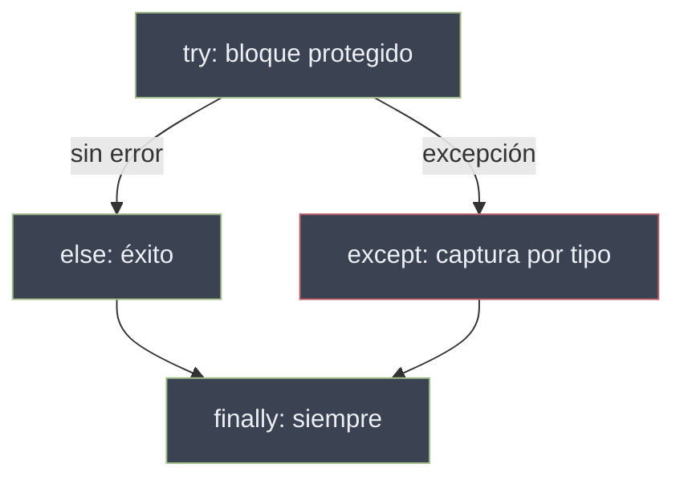

# Manejo de Excepciones

Una **excepción** es un evento que interrumpe el flujo normal de ejecución cuando se produce una condición anómala. En lugar de abortar el programa, Python crea un objeto de error y lo **propaga por la pila de llamadas** hasta que un bloque lo captura o alcanza el nivel superior y termina el proceso.

Python adopta la filosofía **EAFP** (*Easier to Ask Forgiveness than Permission*): se intenta la operación y se captura el fallo, en vez de validar de antemano cada precondición (**LBYL**, *Look Before You Leap*).

```python
# EAFP — estilo idiomático en Python
try:
    valor = datos["clave"]
except KeyError:
    valor = por_defecto
```

## Subtemas

- [[51 Excepciones Built-in/index | Excepciones Built-in]] — la jerarquía que cuelga de `BaseException`, las excepciones más comunes y cómo interpretarlas.
- [[52 Try Except Finally/index | Try Except Finally]] — la estructura de captura: `try`/`except`/`else`/`finally`, captura múltiple y liberación garantizada de recursos.
- [[53 Raise de Excepciones/index | Raise de Excepciones]] — lanzar errores intencionalmente, crear excepciones personalizadas y el encadenamiento con `raise ... from ...`.

## Anatomía del flujo



| Bloque | Se ejecuta | Uso típico | Subtema |
| ------ | ---------- | ---------- | ------- |
| `try` / `except` | `except` solo si se lanza la excepción del tipo capturado | Recuperación del error | [[52 Try Except Finally/index \| Try Except Finally]] |
| `else` / `finally` | `else` si hubo éxito; `finally` siempre | Código de éxito · limpieza | [[52 Try Except Finally/index \| Try Except Finally]] |
| `raise` | Cuando se lanza intencionalmente | Validación, señalización | [[53 Raise de Excepciones/index \| Raise de Excepciones]] |

El tipo de error lanzado pertenece a la [[51 Excepciones Built-in/index | jerarquía de excepciones]], y cualquier operación sobre [[10 Variables y Tipos de Datos/index | tipos]] o [[20 Estructura de Datos/index | colecciones]] puede producir uno.
