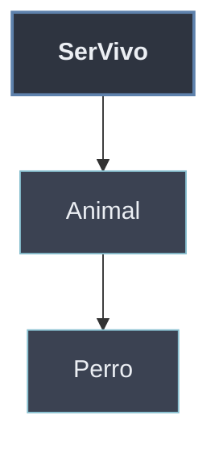

# Herencia Multinivel

> [!definicion]
> La **herencia multinivel** encadena la herencia en **varios niveles**: `C` hereda de `B`, que a su vez hereda de `A` (`A → B → C`). Cada clase tiene **un solo padre directo**, pero la subclase final **acumula todo el linaje**: dispone de los miembros propios y de los de toda la cadena ascendente.

```python
class SerVivo:
    def __init__(self, nombre):
        self.nombre = nombre
    def respirar(self):
        return f"{self.nombre} respira"

class Animal(SerVivo):                 # nivel 2: hereda de SerVivo
    def moverse(self):
        return f"{self.nombre} se mueve"

class Perro(Animal):                   # nivel 3: hereda de Animal
    def hablar(self):
        return "Guau"

p = Perro("Toby")
p.respirar()                           # "Toby respira"   -> de SerVivo
p.moverse()                            # "Toby se mueve"  -> de Animal
p.hablar()                             # "Guau"           -> propio
```

`Perro` reúne tres niveles: el `__init__` y `respirar` de `SerVivo`, `moverse` de `Animal` y `hablar` propio. La búsqueda de cada atributo asciende la cadena nivel a nivel hasta encontrarlo.

## La cadena en `__mro__`

> [!info]
> El atributo `Clase.__mro__` (o `Clase.mro()`) expone el **orden de resolución de métodos**: la secuencia exacta en que Python recorre las clases al buscar un miembro. En multinivel es la cadena ascendente, cerrada siempre por `object`.

```python
Perro.__mro__
# (<class 'Perro'>, <class 'Animal'>, <class 'SerVivo'>, <class 'object'>)

Perro.__bases__                        # (<class 'Animal'>,)  -> solo el padre DIRECTO
```

`__bases__` lista únicamente los padres **directos** (uno solo en multinivel); `__mro__` despliega el **linaje completo**. La construcción de este orden y su papel con `super()` se detalla en [[01 MRO (Method Resolution Order) | MRO]].



## Multinivel frente a múltiple

> [!regla]
> **Multinivel** es una **cadena lineal**: cada clase tiene **un** padre directo y se asciende nivel a nivel (`A → B → C`). **Múltiple** es **varios padres a la vez** en un mismo nivel (`class C(A, B)`). La primera no genera ambigüedad de orden; la segunda sí, y la resuelve el MRO.

| | Multinivel | Múltiple |
| --- | --- | --- |
| Padres directos | Uno | Varios |
| Topología | Cadena `A → B → C` | Confluencia `A, B → C` |
| Orden de búsqueda | Lineal, evidente | Requiere el MRO (C3) |

La distinción se cierra en [[03 Herencia Multiple | herencia múltiple]], donde la confluencia de varios linajes obliga a un orden de resolución no trivial.
