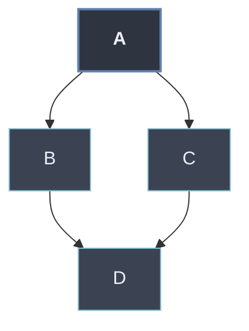

# Herencia Múltiple

> [!definicion]
> La **herencia múltiple** define una subclase a partir de **varias clases base** a la vez: `class C(A, B):`. La subclase **combina** los atributos y métodos de todos sus padres. Es el mecanismo típico de los **mixins**: clases pequeñas que aportan una capacidad concreta (serializar, comparar, registrar) y se mezclan en una clase principal.

```python
class Nadador:
    def desplazarse(self):
        return "nada"

class Volador:
    def desplazarse(self):
        return "vuela"

class Pato(Nadador, Volador):          # combina dos bases
    pass

p = Pato()
p.desplazarse()                        # "nada"  -> gana Nadador (aparece antes)
Pato.__bases__                         # (<class 'Nadador'>, <class 'Volador'>)
```

`Pato` dispone de los miembros de `Nadador` y `Volador`. Cuando ambos definen el mismo nombre (`desplazarse`), hay **ambigüedad**: la decisión de cuál se usa no es arbitraria, la fija el orden de resolución.

## La ambigüedad la resuelve el MRO

> [!info]
> Con varios padres que definen lo mismo, Python recorre las clases en el orden dado por `__mro__`, construido con el algoritmo **C3**. A grandes rasgos respeta el orden de declaración de las bases (de izquierda a derecha) sin repetir ninguna clase. El detalle del algoritmo y de `super()` cooperativo está en [[01 MRO (Method Resolution Order) | MRO]].

```python
Pato.__mro__
# (<class 'Pato'>, <class 'Nadador'>, <class 'Volador'>, <class 'object'>)
# 'desplazarse' se resuelve en Nadador, primero en el MRO
```

## El problema del diamante

> [!ejemplo]
> Cuatro clases en forma de **diamante**: `B` y `C` heredan de `A`, y `D` hereda de `B` y `C`. La pregunta es cuántas veces se recorre `A` y en qué orden. El MRO de Python (C3) garantiza que `A` aparece **una sola vez** y **después** de `B` y `C`.
>
> ```python
> class A:
>     def saludar(self): return "A"
> class B(A):
>     def saludar(self): return "B"
> class C(A):
>     def saludar(self): return "C"
> class D(B, C):
>     pass
>
> D().saludar()        # "B"  -> B precede a C, y ambos a A
> [k.__name__ for k in D.__mro__]
> # ['D', 'B', 'C', 'A', 'object']  -> A una sola vez, al final
> ```

El uso de [[01 super() y Constructor del Padre | super()]] en un diamante recorre el MRO completo de forma **cooperativa**: cada clase delega en la siguiente del orden, no en su padre directo, lo que permite que `A.__init__` se ejecute una única vez.



## Riesgos y cuándo evitarla

> [!warning]
> La herencia múltiple es potente pero **frágil**:
> - **Colisiones de nombres** entre bases, resueltas por un orden (MRO) que no siempre es obvio.
> - **Acoplamiento fuerte**: la subclase depende de la implementación interna de varios linajes a la vez.
> - **`super()` cooperativo** exige que todas las clases de la jerarquía cooperen (firmas compatibles, llamadas a `super()` consistentes); un eslabón mal diseñado rompe la cadena.
>
> Reservarla para **mixins** ortogonales y bien acotados. Cuando la relación real es **"tiene un"** y no **"es un"**, preferir la [[70 Relaciones entre Objetos/index | composición]]: menos acoplamiento y sin ambigüedad de orden.

A diferencia de la [[01 Herencia Simple | herencia simple]] y la [[02 Herencia Multinivel | multinivel]], cuyo orden de búsqueda es lineal y predecible, la múltiple solo es manejable con un conocimiento claro del MRO.
