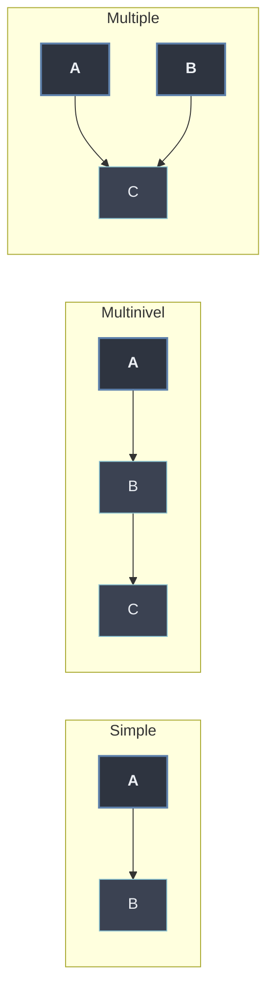

# Tipos de Herencia

Los **tipos de herencia** se clasifican según **cuántas** clases base tiene una subclase y **cómo** se disponen entre sí. Tres formas básicas: una sola base (**simple**), una **cadena** de bases encadenadas (**multinivel**) y **varias** bases a la vez (**múltiple**). La clasificación es estructural: describe la topología del grafo de herencia, no el mecanismo (`super()`, *override*) con que la subclase reutiliza lo heredado, delegado a [[32 Mecanismos de Herencia/index | Mecanismos de Herencia]].

```python
class A: ...
class B(A): ...            # simple:      B tiene un padre
class C(B): ...            # multinivel:  C -> B -> A (cadena)
class D(A, B): ...         # múltiple:    D tiene dos padres
```

## Subtemas

- [[01 Herencia Simple | Herencia Simple]] — una única clase base; la subclase hereda, añade y redefine. `isinstance` / `issubclass`.
- [[02 Herencia Multinivel | Herencia Multinivel]] — cadena lineal `A → B → C`; la subclase final acumula todo el linaje.
- [[03 Herencia Multiple | Herencia Múltiple]] — varias bases combinadas (típico de *mixins*); introduce ambigüedad y el problema del diamante.

## Mapa de los tipos

| Tipo | Forma | Esquema | Ejemplo |
| ---- | ----- | ------- | ------- |
| Simple | Un solo padre | `A → B` | `class Perro(Animal)` |
| Multinivel | Cadena de padres | `A → B → C` | `class Perro(Animal)`, `class Animal(SerVivo)` |
| Múltiple | Varios padres | `A, B → C` | `class C(A, B)` |



## La múltiple introduce el MRO

> [!info]
> Mientras la simple y la multinivel tienen un orden de búsqueda **lineal y evidente** (basta ascender por la cadena), la **múltiple** plantea la pregunta de qué padre gana cuando dos bases definen el mismo nombre. La respuesta la da el **orden de resolución de métodos**, detallado en [[33 MRO y super() Cooperativo/index | MRO y super() Cooperativo]].

Cualquiera de las tres formas habilita el [[40 Polimorfismo/index | polimorfismo]] de subtipos: la subclase puede sustituir a su base en cualquier contexto que la espere.
