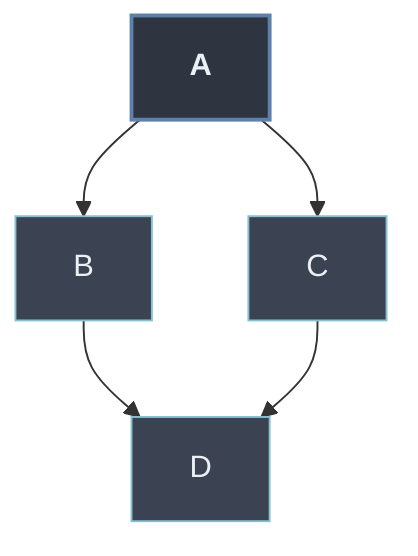

# MRO y super() Cooperativo

Con [[03 Herencia Multiple | herencia múltiple]] aparece la ambigüedad: si dos bases definen el mismo método o atributo, Python necesita un **orden determinista** para decidir cuál gana. Ese orden es el **MRO** (*Method Resolution Order*), una secuencia lineal calculada por el algoritmo **C3**. La función `super()` no salta "al padre", sino al **siguiente en ese MRO**, lo que permite que una cadena de clases coopere y cada una ejecute su parte **una sola vez** (herencia cooperativa).

```python
class A: ...
class B(A): ...
class C(A): ...
class D(B, C): ...        # diamante

D.__mro__                 # (D, B, C, A, object)  -> orden lineal y único
```

## Subtemas

- [[01 MRO (Method Resolution Order) | MRO (Method Resolution Order)]] — la secuencia lineal de búsqueda; algoritmo C3, propiedades, `__mro__` y el problema del diamante.
- [[02 super() Cooperativo | super() Cooperativo]] — `super()` recorre el MRO, no la jerarquía; cómo encadenar mixins con firmas compatibles.

## Mapa del subtema

| Concepto | Pregunta que responde | Hoja |
| -------- | --------------------- | ---- |
| MRO / C3 | Con varios padres, ¿en qué orden se busca? | [[01 MRO (Method Resolution Order) \| MRO]] |
| `super()` cooperativo | ¿Cómo llamo al *siguiente* y encadeno mixins? | [[02 super() Cooperativo \| super() Cooperativo]] |



El MRO es la pieza que cierra los [[32 Mecanismos de Herencia/index | Mecanismos de Herencia]]: define exactamente qué resuelve cada llamada cuando el grafo deja de ser una simple cadena.
</content>
</invoke>
