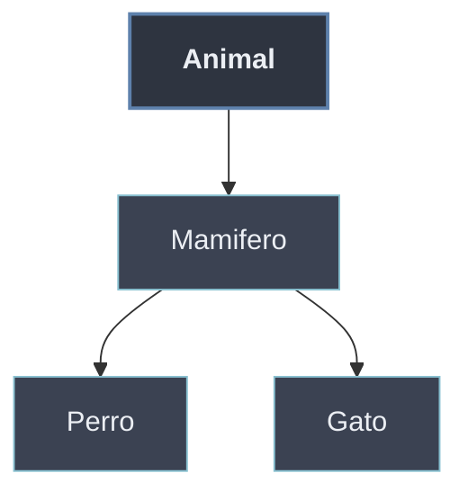

# Herencia

La **herencia** permite definir una clase nueva (**subclase** o clase derivada) a partir de otra (**superclase** o clase base), heredando sus atributos y métodos y pudiendo añadirlos o redefinirlos. Modela la relación **"es un"**: un `Perro` *es un* `Animal`, por lo que reutiliza su comportamiento y especializa lo que difiere.

```python
class Animal:
    def __init__(self, nombre):
        self.nombre = nombre
    def hablar(self):
        return "..."

class Perro(Animal):           # Perro hereda de Animal
    def hablar(self):          # sobrescribe el método
        return "Guau"

Perro("Toby").hablar()         # "Guau"
```

La herencia es potente pero acoplante: cuando la relación real es **"tiene un"** en lugar de **"es un"**, conviene la [[70 Relaciones entre Objetos/index | composición]].

## Subtemas

- [[31 Tipos de Herencia/index | Tipos de Herencia]] — simple (un padre), multinivel (cadena de herencia) y múltiple (varios padres).
- [[32 Mecanismos de Herencia/index | Mecanismos de Herencia]] — `super()` para invocar al padre, sobrescritura (*override*) y extensión de métodos.
- [[33 MRO y super() Cooperativo/index | MRO y super() Cooperativo]] — el orden de resolución de métodos (C3) y cómo `super()` coopera en herencia múltiple.

## Mapa de la herencia

| Concepto | Pregunta que responde | Subtema |
| -------- | --------------------- | ------- |
| Simple / multinivel / múltiple | ¿Cuántos y cómo son los padres? | [[31 Tipos de Herencia/index \| Tipos de Herencia]] |
| `super()` · override · extensión | ¿Cómo reutilizo o reemplazo lo heredado? | [[32 Mecanismos de Herencia/index \| Mecanismos de Herencia]] |
| MRO (`__mro__`) | Con varios padres, ¿qué método gana? | [[33 MRO y super() Cooperativo/index \| MRO y super() Cooperativo]] |



La redefinición de métodos en las subclases es la base del [[40 Polimorfismo/index | polimorfismo]] de subtipos: una misma llamada produce comportamientos distintos según la clase real del objeto.
