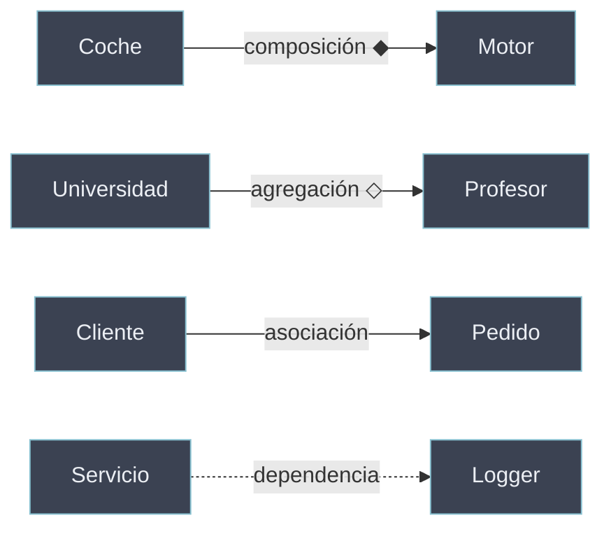

# Relaciones entre Objetos

Más allá de la herencia (**"es un"**), los objetos se vinculan por **colaboración**: un objeto contiene a otro, lo usa o depende de él. Distinguir el tipo de relación —y su fuerza— determina el acoplamiento del diseño y el ciclo de vida de los objetos implicados. Estas relaciones modelan el **"tiene un"** y el **"usa un"**, alternativas a la herencia que suelen producir diseños más flexibles.

```python
class Motor: ...
class Coche:
    def __init__(self):
        self.motor = Motor()   # composición: el Coche "tiene un" Motor
```

## Subtemas

- [[71 Composicion | Composición]] — el todo posee a la parte; ciclo de vida ligado (*"tiene un"* fuerte).
- [[72 Agregacion | Agregación]] — el todo agrupa partes que existen de forma independiente (*"tiene un"* débil).
- [[73 Asociacion | Asociación]] — objetos que se conocen y colaboran sin contención (*"usa un"*).
- [[74 Dependencia | Dependencia]] — un objeto usa a otro de forma puntual (parámetro, retorno) (*"depende de"*).
- [[75 Mixins | Mixins]] — clases que aportan comportamiento reutilizable vía [[31 Tipos de Herencia/index | herencia múltiple]].
- [[76 Composicion vs Herencia | Composición vs Herencia]] — cuándo preferir contener a heredar.

## Espectro de acoplamiento

| Relación | Semántica | Fuerza / ciclo de vida | Subtema |
| -------- | --------- | ---------------------- | ------- |
| Composición | "tiene un" (parte exclusiva) | Fuerte: la parte muere con el todo | [[71 Composicion \| Composición]] |
| Agregación | "tiene un" (parte compartida) | Débil: la parte sobrevive al todo | [[72 Agregacion \| Agregación]] |
| Asociación | "usa un" | Los objetos se referencian | [[73 Asociacion \| Asociación]] |
| Dependencia | "depende de" | Puntual: solo durante una operación | [[74 Dependencia \| Dependencia]] |



La regla de diseño *"composición sobre herencia"* —desarrollada en [[76 Composicion vs Herencia | Composición vs Herencia]]— recomienda estas relaciones frente a la [[30 Herencia/index | herencia]] cuando no hay una verdadera relación de subtipo.
