# Programación Orientada a Objetos

La **programación orientada a objetos** (POO) organiza el programa en torno a **objetos**: entidades que agrupan **estado** (datos) y **comportamiento** (operaciones sobre esos datos) en una sola unidad. Frente al [[Tema 01 Programación Orientada a Procesos/index | enfoque por procesos]], donde los datos y las funciones que los manipulan viven separados, la POO los une bajo una **clase** —el molde— del que se crean **instancias** —los objetos concretos.

En Python la POO no es opcional ni accesoria: **todo es un objeto** (los enteros, las funciones, las propias clases). Dominar el modelo de objetos es entender cómo funciona el lenguaje por dentro.

```python
class Punto:
    def __init__(self, x, y):   # constructor: inicializa el estado
        self.x = x
        self.y = y
    def distancia_origen(self):  # comportamiento: opera sobre el estado
        return (self.x**2 + self.y**2) ** 0.5

p = Punto(3, 4)        # instanciación: Punto es la clase, p el objeto
p.distancia_origen()   # 5.0
```

## Los cuatro pilares

| Pilar | Idea | Subtema |
| ----- | ---- | ------- |
| **Abstracción** | Exponer *qué* hace un objeto, ocultar *cómo* | [[60 Abstraccion/index \| Abstracción]] |
| **Encapsulamiento** | Proteger el estado tras una interfaz controlada | [[20 Encapsulamiento/index \| Encapsulamiento]] |
| **Herencia** | Derivar clases nuevas reutilizando otras | [[30 Herencia/index \| Herencia]] |
| **Polimorfismo** | Una misma interfaz, comportamientos distintos | [[40 Polimorfismo/index \| Polimorfismo]] |

## Subtemas

- [[10 Clases y Objetos/index | Clases y Objetos]] — el molde y la instancia: definición de clases, atributos (estado) y métodos (comportamiento).
- [[20 Encapsulamiento/index | Encapsulamiento]] — visibilidad de los atributos (`_`, `__`, *name mangling*) y acceso controlado mediante `property`.
- [[30 Herencia/index | Herencia]] — derivación de clases: simple, multinivel y múltiple; `super()`, sobrescritura y el orden de resolución de métodos (MRO).
- [[40 Polimorfismo/index | Polimorfismo]] — *duck typing*, polimorfismo de subtipos y sobrecarga de operadores.
- [[50 Metodos Especiales (Dunder)/index | Métodos Especiales (Dunder)]] — los métodos `__x__` que integran un objeto con la sintaxis del lenguaje.
- [[60 Abstraccion/index | Abstracción]] — clases abstractas (`abc`), `@abstractmethod` e interfaces formales e informales.
- [[70 Relaciones entre Objetos/index | Relaciones entre Objetos]] — composición, agregación, asociación, dependencia y *mixins*.
- [[80 Patrones de Diseño/index | Patrones de Diseño]] — soluciones recurrentes: Singleton, Factory Method, Strategy, Observer.
- [[90 Herramientas Modernas/index | Herramientas Modernas]] — `dataclasses`, `__slots__`, `__new__` y `Enum`.
- [[00 Referencias/index | Referencias]] — catálogo de métodos dunder y glosario de términos POO.

## Clase frente a objeto

```mermaid
flowchart LR
    classDef clase fill:#2e3440,stroke:#5e81ac,stroke-width:2px,color:#eceff4,font-weight:bold;
    classDef obj fill:#3b4252,stroke:#88c0d0,color:#eceff4;
    C[clase Punto<br/>molde: atributos + métodos]:::clase
    C -->|Punto&#40;3,4&#41;| O1[objeto p1<br/>x=3, y=4]:::obj
    C -->|Punto&#40;0,1&#41;| O2[objeto p2<br/>x=0, y=1]:::obj
    C -->|Punto&#40;5,5&#41;| O3[objeto p3<br/>x=5, y=5]:::obj
```



La **clase** define la estructura una sola vez; cada **instancia** mantiene su propio estado y comparte el comportamiento definido en la clase. Sobre esta distinción se construyen [[10 Clases y Objetos/index | clases y objetos]], y de ella derivan el resto de mecanismos del paradigma.
