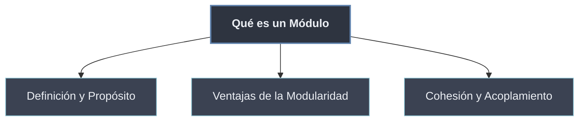

# Qué es un Módulo

Un **módulo** es la **unidad básica** de la programación modular: una porción de código con **una responsabilidad** y un **espacio de nombres propio**, que se puede **reutilizar** desde otros sitios sin copiarlo. En Python esa unidad es, en su forma más simple, **un archivo `.py`**. Esta subcarpeta responde tres preguntas: qué es exactamente un módulo, **por qué** conviene dividir en módulos, y **cómo medir** si la división es acertada.

```python
# calculadora.py  -> un modulo: archivo .py reutilizable con namespace propio
def sumar(a, b):
    return a + b

def restar(a, b):
    return a - b
```

## Subtemas

- [[01 Definicion y Proposito | Definición y Propósito]] — qué es un módulo (archivo `.py` con namespace propio) y para qué sirve: organizar, reutilizar y dar espacio de nombres. Módulo frente a script.
- [[02 Ventajas de la Modularidad | Ventajas de la Modularidad]] — reutilización, mantenibilidad, separación de responsabilidades, namespaces que evitan colisiones, testing y trabajo en equipo.
- [[03 Cohesion y Acoplamiento | Cohesión y Acoplamiento]] — alta cohesión (un módulo, una responsabilidad) y bajo acoplamiento (dependencias mínimas vía interfaz); ejemplos de buen y mal diseño.

## Mapa de la subcarpeta

| Nota | Pregunta que responde |
| ---- | --------------------- |
| Definición y Propósito | ¿Qué es un módulo y por qué no basta un script? |
| Ventajas de la Modularidad | ¿Qué gano al dividir el código en módulos? |
| Cohesión y Acoplamiento | ¿Cómo sé si mi división en módulos es buena? |



La definición fija **qué** es la unidad; las ventajas justifican **por qué** usarla; la cohesión y el acoplamiento dan el **criterio** para juzgar cada división concreta. Cómo Python encarna el módulo —su `__name__`, su `__dict__`— se detalla en [[20 Modulos en Python/index | Módulos en Python]].
