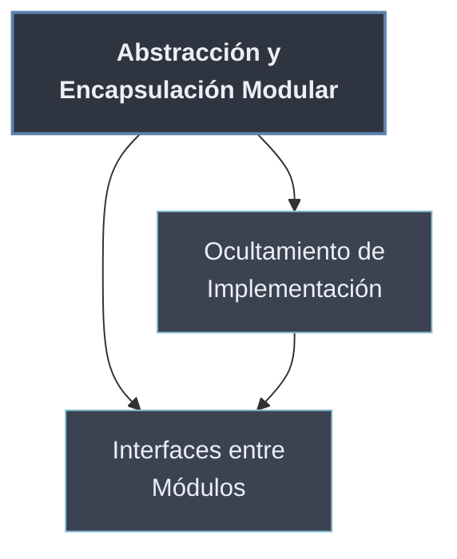

# Abstracción y Encapsulación Modular

La **encapsulación**, que en [[Tema 02 Programación Orientada a Objetos/index | POO]] separa el interior de un objeto de su exterior, asciende aquí al **nivel de módulo**: un módulo bien diseñado **expone el *qué*** (un puñado de funciones y clases públicas) y **oculta el *cómo*** (variables auxiliares, helpers, estructuras internas). Lo que se expone es la **interfaz**; el resto es **detalle de implementación** que el módulo se reserva el derecho a cambiar.

Esta separación es lo que hace posible el **bajo acoplamiento** de [[11 Que es un Modulo/03 Cohesion y Acoplamiento | Cohesión y Acoplamiento]]: si los demás solo dependen de la interfaz, sus tripas pueden reescribirse sin romper nada.

```python
# tarifas.py
def precio_final(base):            # PUBLICO: el "que"
    return base + _impuesto(base)

def _impuesto(base):               # PRIVADO (_): el "como", oculto
    return base * 0.21
```

## Subtemas

- [[01 Ocultamiento de Implementacion | Ocultamiento de Implementación]] — exponer el *qué* y ocultar el *cómo* a nivel de módulo; la convención `_privado` y qué conviene publicar.
- [[02 Interfaces entre Modulos | Interfaces entre Módulos]] — el contrato (API) que un módulo ofrece a otros; depender de interfaces estables y no de detalles internos.

## Mapa de la subcarpeta

| Nota | Pregunta que responde |
| ---- | --------------------- |
| Ocultamiento de Implementación | ¿Qué publico de un módulo y qué escondo? |
| Interfaces entre Módulos | ¿De qué de otro módulo me permito depender? |



Ocultar la implementación es la **decisión interna** de cada módulo; la interfaz es el **contrato externo** que resulta de ella. Ambas se materializan en Python con la convención `_privado` y, más adelante, con [[60 Diseno de APIs Modulares/index | __all__ y el diseño explícito de APIs]].
