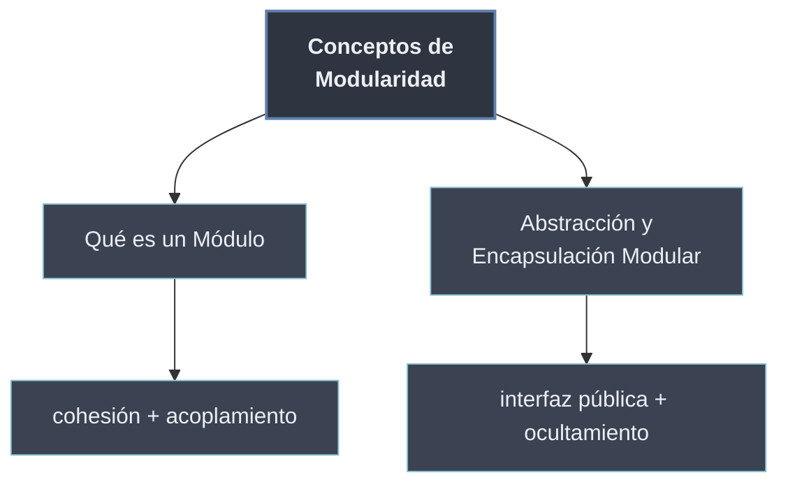

# Conceptos de Modularidad

Antes de escribir el primer `import`, la **modularidad** es un conjunto de **ideas de diseño**: dividir un programa en **unidades autónomas** —los **módulos**— cada una con **una responsabilidad** y una **interfaz** clara con el resto. Esta sección fija ese vocabulario conceptual; los **mecanismos** con que Python lo materializa (archivos `.py`, `import`, paquetes) llegan en [[20 Modulos en Python/index | Módulos en Python]] y siguientes.

Dos principios gobiernan todo lo demás: **alta cohesión** (un módulo hace una sola cosa) y **bajo acoplamiento** (depende lo mínimo de los demás, y solo a través de su interfaz pública). El **ocultamiento de implementación** —exponer el *qué* y esconder el *cómo*— es la herramienta que hace posible mantener bajo el acoplamiento.

```python
# geometria.py  -> una responsabilidad: calculo geometrico
PI = 3.14159                       # interfaz publica
def area_circulo(r):
    return PI * r ** 2

def _validar(r):                   # detalle interno: convencion _privado
    if r < 0:
        raise ValueError("radio negativo")
```

## Subtemas

- [[11 Que es un Modulo/index | Qué es un Módulo]] — la definición de módulo, sus ventajas frente al script monolítico y los conceptos de cohesión y acoplamiento.
- [[12 Abstraccion y Encapsulacion Modular/index | Abstracción y Encapsulación Modular]] — cómo un módulo oculta su implementación y define la interfaz por la que otros módulos lo consumen.

## Mapa de los conceptos

| Concepto | Pregunta que responde | Subtema |
| -------- | --------------------- | ------- |
| Módulo / script | ¿Qué es una unidad modular y en qué se diferencia de un programa suelto? | [[11 Que es un Modulo/index \| Qué es un Módulo]] |
| Ventajas | ¿Por qué dividir en módulos en vez de un solo archivo? | [[11 Que es un Modulo/index \| Qué es un Módulo]] |
| Cohesión / acoplamiento | ¿Cómo mido si la división es buena? | [[11 Que es un Modulo/index \| Qué es un Módulo]] |
| Ocultamiento / interfaz | ¿Qué expongo y qué escondo de cada módulo? | [[12 Abstraccion y Encapsulacion Modular/index \| Abstracción y Encapsulación Modular]] |



La cohesión y el acoplamiento son **criterios de calidad**; el ocultamiento de implementación y las interfaces son **técnicas** para conseguirlos. Juntos definen qué hace que una división en módulos sea **buena**, antes de discutir *cómo* Python la implementa.
