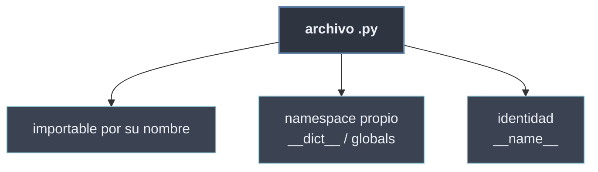

# Estructura de Módulos

La **estructura de un módulo** son los tres hechos que el intérprete garantiza sobre cualquier archivo `.py` cuando se importa: que es **importable por su nombre** sin la extensión, que su código de nivel superior **se ejecuta una sola vez** dejando los nombres en un **namespace propio**, y que ese código puede saber **cómo fue cargado** mediante la variable `__name__`. No es sintaxis nueva: es el comportamiento interno que convierte un fichero en una unidad reutilizable.

```python
# utilidades.py
print("cargando utilidades")     # se ejecuta UNA vez, al importar
VERSION = "1.0"                  # queda en el namespace del modulo

import utilidades                # "cargando utilidades"
utilidades.VERSION               # "1.0"  -> acceso cualificado al namespace
utilidades.__name__              # "utilidades"
```

## Subtemas

- [[01 Archivos .py como Modulos | Archivos .py como Módulos]] — todo `.py` es un módulo importable por su nombre; el código de nivel superior se ejecuta una vez al importarse.
- [[02 Namespace del Modulo | Namespace del Módulo]] — cada módulo tiene su propio espacio de nombres: `__dict__`, acceso `modulo.nombre`, `dir()` y `globals()`.
- [[03 __name__ y __main__ | __name__ y __main__]] — `__name__` vale el nombre del módulo o `"__main__"` si se ejecuta directo; el idioma `if __name__ == "__main__":`.

## Mapa de la estructura

| Hecho | En qué se traduce | Hoja |
| ----- | ----------------- | ---- |
| El archivo es importable | `import nombre_sin_py` ejecuta el módulo una vez | [[01 Archivos .py como Modulos \| Archivos .py como Módulos]] |
| Los nombres viven aislados | `modulo.__dict__`, `modulo.x`, `dir(modulo)` | [[02 Namespace del Modulo \| Namespace del Módulo]] |
| El módulo conoce su origen | `__name__` == `"__main__"` o el nombre del módulo | [[03 __name__ y __main__ \| __name__ y __main__]] |



Conocer la estructura interna del módulo es lo que vuelve predecible la [[22 Importacion de Modulos/index | importación]]: importar es, en el fondo, ejecutar el archivo una vez y enlazar su namespace al nuestro.
