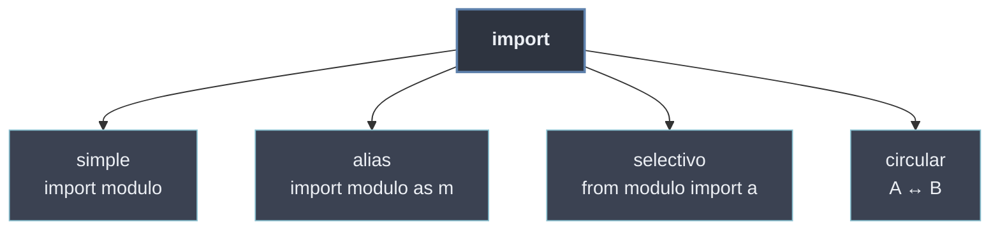

# Importación de Módulos

La **importación** es el acto de traer un módulo al código actual para usar sus nombres. Python ofrece varias formas que se diferencian en **qué** queda accesible y **bajo qué nombre**: importar el módulo entero (`import`), darle un alias (`as`), traer solo algunos nombres (`from … import`) o todos (`*`). Todas comparten la misma maquinaria —ejecutar el módulo una vez y **cachearlo**— y todas pueden tropezar con el caso patológico de la **importación circular**.

```python
import math                      # modulo entero, acceso cualificado: math.pi
import numpy as np               # alias: np.array(...)
from math import pi, sqrt        # selectivo: pi, sqrt directos
from math import *               # todos los publicos (desaconsejado)
```

## Subtemas

- [[01 Import Simple | Import Simple]] — `import modulo`; acceso cualificado `modulo.attr`; se importa una sola vez (cache).
- [[02 Import con Alias | Import con Alias]] — `import modulo as m`; convención `import numpy as np`; alias para acortar y evitar colisiones.
- [[03 Import Selectivo (from import) | Import Selectivo (from import)]] — `from modulo import a, b`; `from modulo import *` y sus riesgos.
- [[04 Importacion Circular y Soluciones | Importación Circular y Soluciones]] — qué es un import circular, por qué falla y cómo resolverlo.

## Mapa de las importaciones

| Forma | Qué queda accesible | Hoja |
| ----- | ------------------- | ---- |
| `import modulo` | el módulo; acceso `modulo.attr` | [[01 Import Simple \| Import Simple]] |
| `import modulo as m` | el módulo bajo el alias `m` | [[02 Import con Alias \| Import con Alias]] |
| `from modulo import a, b` | los nombres `a`, `b` directos | [[03 Import Selectivo (from import) \| Import Selectivo (from import)]] |
| `from modulo import *` | todos los públicos (riesgoso) | [[03 Import Selectivo (from import) \| Import Selectivo (from import)]] |
| A ↔ B se importan entre sí | falla: módulo a medio inicializar | [[04 Importacion Circular y Soluciones \| Importación Circular y Soluciones]] |



Qué forma elegir es una decisión de **legibilidad y de interfaz**: el import selectivo y los alias afectan a cómo se lee el código que consume el módulo, y `from … import *` se controla con la [[62 Exposicion Selectiva (__all__) | exposición selectiva (`__all__`)]].
