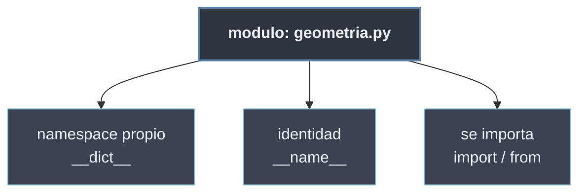

# Módulos en Python

En Python un **módulo** es, simplemente, **un archivo `.py`**. No hace falta declarar nada: el intérprete trata todo fichero de código como una unidad importable, le da un **namespace propio** y lo expone como un objeto de tipo `module`. Ese es el mecanismo más básico de la modularidad: repartir el código en archivos que se importan unos a otros por su nombre.

Cada módulo se ejecuta **una sola vez** al importarse, guarda sus nombres en su propio espacio y conoce su identidad a través de la variable `__name__`. Sobre estos tres hechos —archivo, namespace y nombre— se levantan todas las formas de `import`.

```python
# geometria.py  -> el archivo es el modulo "geometria"
PI = 3.14159
def area_circulo(r):
    return PI * r ** 2

# main.py  -> lo consume por su nombre, sin la extension .py
import geometria
geometria.area_circulo(2)        # 12.566...
print(geometria.__name__)        # "geometria"
```

## Subtemas

- [[21 Estructura de Modulos/index | Estructura de Módulos]] — qué hace de un `.py` un módulo: ejecución única, namespace propio (`__dict__`) y la variable `__name__`/`__main__`.
- [[22 Importacion de Modulos/index | Importación de Módulos]] — las formas de traer un módulo al código: `import`, alias, `from … import`, y el problema de la importación circular.

## Mapa de los módulos

| Concepto | Pregunta que responde | Subtema |
| -------- | --------------------- | ------- |
| Archivo `.py` · namespace · `__name__` | ¿Qué es un módulo por dentro? | [[21 Estructura de Modulos/index \| Estructura de Módulos]] |
| `import` · `as` · `from … import` | ¿Cómo traigo un módulo a mi código? | [[22 Importacion de Modulos/index \| Importación de Módulos]] |
| Import circular | ¿Por qué dos módulos que se importan mutuamente fallan? | [[22 Importacion de Modulos/index \| Importación de Módulos]] |



El módulo es la pieza atómica de la modularidad: la [[30 Paquetes y Subpaquetes/index | agrupación de módulos en paquetes]] y el [[40 Sistema de Modulos de Python/index | sistema de importación]] se construyen sobre este archivo `.py` con namespace propio.
