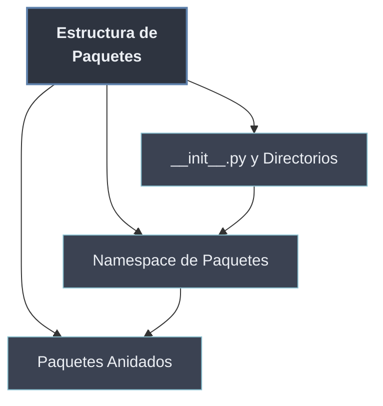

# Estructura de Paquetes

La **estructura de un paquete** describe **qué hace de un directorio un paquete** y cómo se organiza por dentro. Tres ideas la componen: el archivo `__init__.py`, que **declara** la carpeta como paquete importable; el paquete entendido como un **namespace** (`paquete.modulo`, con sus propios atributos y `__path__`); y la **anidación** de unos paquetes dentro de otros para formar la jerarquía `paquete.subpaquete.modulo`.

Es la cara **estructural** de los paquetes: describe la topología en disco y el namespace resultante, no el mecanismo de importación (absoluto vs relativo), delegado a [[32 Sistemas de Importacion/index | Sistemas de Importación]].

```python
# paquete/
#   __init__.py        -> declara 'paquete' como paquete
#   modulo.py
#   subpaquete/
#     __init__.py      -> declara 'paquete.subpaquete'
#     otro.py

import paquete.subpaquete.otro     # jerarquía completa
paquete.__path__                   # ['.../paquete']  -> dónde buscar submódulos
```

## Subtemas

- [[01 __init__.py y Directorios | __init__.py y Directorios]] — el archivo que convierte un directorio en paquete; qué puede contener (vacío, código de inicialización, reexports).
- [[02 Namespace de Paquetes | Namespace de Paquetes]] — el paquete como namespace: acceso `paquete.modulo`, atributos del paquete y `__path__`.
- [[03 Paquetes Anidados | Paquetes Anidados]] — subpaquetes y la jerarquía `paquete.subpaquete.modulo`; cómo se importan y organizan.

## Mapa de la estructura

| Concepto | Pregunta que responde | Subtema |
| -------- | --------------------- | ------- |
| `__init__.py` | ¿Qué declara una carpeta como paquete? | [[01 __init__.py y Directorios \| __init__.py y Directorios]] |
| `paquete.modulo` / `__path__` | ¿Qué es el namespace de un paquete? | [[02 Namespace de Paquetes \| Namespace de Paquetes]] |
| `paquete.subpaquete.modulo` | ¿Cómo anido paquetes dentro de paquetes? | [[03 Paquetes Anidados \| Paquetes Anidados]] |



Primero un directorio se vuelve paquete (`__init__.py`), luego ese paquete es un namespace consultable (`paquete.modulo`), y por último ese namespace se anida en jerarquías de cualquier profundidad. Sobre esa estructura operan las [[32 Sistemas de Importacion/index | importaciones]].
