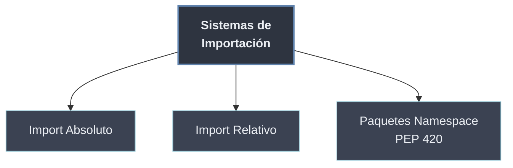

# Sistemas de Importación

Los **sistemas de importación** son las **formas de nombrar y traer** un módulo que vive dentro de un paquete. Dos estilos resuelven la misma necesidad desde ángulos opuestos: el **import absoluto** nombra la ruta completa desde la raíz del proyecto (`from paquete.modulo import x`), y el **import relativo** la nombra **desde el paquete actual** (`from . import x`, `from ..pkg import y`). A ellos se suma un tipo especial de paquete —el **paquete namespace** de PEP 420— que prescinde de `__init__.py` y puede repartirse entre varias rutas.

Es la cara **operativa** de los paquetes: dado el namespace que define la [[31 Estructura de Paquetes/index | estructura del paquete]], aquí se decide *cómo* se referencia y carga cada pieza.

```python
from paquete.utils import validar     # absoluto:  ruta completa desde la raíz
from . import validar                  # relativo:  desde el paquete actual
from ..otro import calcular            # relativo:  sube un nivel y baja a 'otro'
```

## Subtemas

- [[01 Import Absoluto | Import Absoluto]] — `from paquete.modulo import x`; la ruta completa desde la raíz, recomendada por PEP 8.
- [[02 Import Relativo | Import Relativo]] — `from . import x`, `from ..pkg import y`; el punto como paquete actual, solo válido dentro de paquetes.
- [[03 Paquetes Namespace (PEP 420) | Paquetes Namespace (PEP 420)]] — paquetes sin `__init__.py` repartidos en varias rutas; cuándo se usan y en qué se diferencian de los regulares.

## Mapa de la importación

| Sistema | Forma | Subtema |
| ------- | ----- | ------- |
| Absoluto | `from paquete.modulo import x` | [[01 Import Absoluto \| Import Absoluto]] |
| Relativo | `from . import x` · `from ..pkg import y` | [[02 Import Relativo \| Import Relativo]] |
| Namespace | paquete sin `__init__.py`, multi-ruta | [[03 Paquetes Namespace (PEP 420) \| Paquetes Namespace (PEP 420)]] |



El import absoluto es el estilo por defecto y más robusto; el relativo es conciso dentro de un paquete; los paquetes namespace son un caso de organización distribuida. Todos se apoyan en la [[40 Sistema de Modulos de Python/index | maquinaria de importación]] (`sys.path`, `sys.modules`) que los hace posibles.
