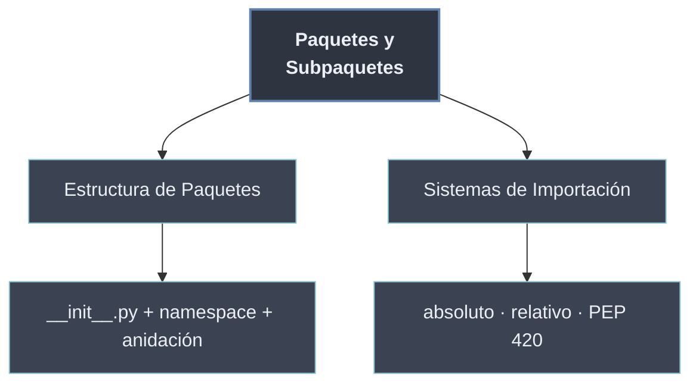

# Paquetes y Subpaquetes

Un **paquete** es un **directorio de módulos**: la forma en que Python agrupa varios archivos `.py` relacionados bajo un mismo nombre jerárquico. Donde un [[20 Modulos en Python/index | módulo]] es un archivo con un namespace propio, un paquete es una **carpeta** que se importa como `paquete.modulo` y puede contener, a su vez, otros paquetes (**subpaquetes**). Es el mecanismo con que un proyecto pasa de un puñado de archivos sueltos a una **arquitectura navegable**.

Lo que convierte un directorio cualquiera en paquete es el archivo `__init__.py`: su presencia declara la carpeta como paquete importable y, opcionalmente, inicializa o reexporta su contenido. Sobre esa estructura, las importaciones —**absolutas** desde la raíz o **relativas** desde el paquete actual— resuelven qué módulo se trae y desde dónde.

```python
# Estructura en disco          # Cómo se importa
# mi_pkg/                      import mi_pkg
#   __init__.py                from mi_pkg import geometria
#   geometria.py               from mi_pkg.utils import validar
#   utils/                     import mi_pkg.utils.validar
#     __init__.py
#     validar.py
```

## Subtemas

- [[31 Estructura de Paquetes/index | Estructura de Paquetes]] — qué hace de un directorio un paquete: `__init__.py`, el paquete como namespace y la anidación en subpaquetes.
- [[32 Sistemas de Importacion/index | Sistemas de Importación]] — las formas de traer módulos de un paquete: import absoluto, relativo y los paquetes namespace de PEP 420.

## Mapa de los paquetes

| Concepto | Pregunta que responde | Subtema |
| -------- | --------------------- | ------- |
| `__init__.py` / `__path__` | ¿Qué convierte una carpeta en paquete? | [[31 Estructura de Paquetes/index \| Estructura de Paquetes]] |
| Anidación | ¿Cómo organizo paquetes dentro de paquetes? | [[31 Estructura de Paquetes/index \| Estructura de Paquetes]] |
| Import absoluto vs relativo | ¿Cómo nombro qué módulo traer? | [[32 Sistemas de Importacion/index \| Sistemas de Importación]] |
| PEP 420 | ¿Y si no quiero `__init__.py`? | [[32 Sistemas de Importacion/index \| Sistemas de Importación]] |



La estructura define *qué es* un paquete; la importación define *cómo se accede* a él. Juntas son la base sobre la que se apoyan la [[40 Sistema de Modulos de Python/index | maquinaria de importación]] y la [[50 Organizacion de Proyectos/index | organización de proyectos]] de las secciones siguientes.
