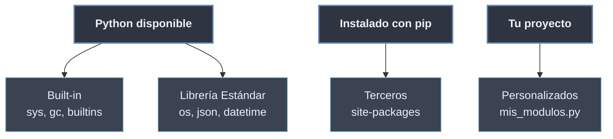

# Jerarquía de Módulos

La **jerarquía de módulos** clasifica todo lo importable según **de dónde proviene**. Son cuatro orígenes, de más "interno" a más "externo": los **built-in** compilados en el propio intérprete, la **librería estándar** que acompaña a cada instalación de Python, los módulos de **terceros** instalados con `pip` desde PyPI y los **personalizados** que escribe el propio proyecto. La clasificación es de **procedencia**, no de sintaxis: los cuatro se importan igual con `import`.

```python
import sys          # built-in: compilado en el intérprete
import json         # estándar: viene con Python, es un .py
import requests     # terceros: instalado con pip (si está disponible)
import mi_modulo    # personalizado: del propio proyecto
```

## Subtemas

- [[01 Modulos Built-in | Módulos Built-in]] — compilados dentro del intérprete (`sys`, `builtins`, `gc`); no tienen archivo `.py`. `sys.builtin_module_names`.
- [[02 Libreria Estandar | Librería Estándar]] — *"batteries included"*: `os`, `json`, `datetime`, `collections`; vienen con Python pero son archivos `.py`.
- [[03 Modulos de Terceros | Módulos de Terceros]] — instalados con `pip` desde PyPI; viven en `site-packages` y se aíslan con entornos virtuales.
- [[04 Modulos Personalizados | Módulos Personalizados]] — los del propio proyecto; cómo los encuentra Python y su relación con la raíz del proyecto.

## Mapa de los orígenes

| Origen | ¿Archivo `.py`? | ¿Dónde vive? | Cómo llega |
| ------ | --------------- | ------------ | ---------- |
| Built-in | No (compilado en C) | Dentro del intérprete | Con Python | 
| Librería estándar | Sí | Instalación de Python (`lib/`) | Con Python |
| Terceros | Sí | `site-packages` | `pip install` |
| Personalizados | Sí | Raíz del proyecto | Los escribes tú |



El orden en que Python busca entre estos orígenes ante un `import` lo fija la lista de rutas `sys.path`, detallada en [[42 Mecanismos de Importacion/index | Mecanismos de Importación]].
