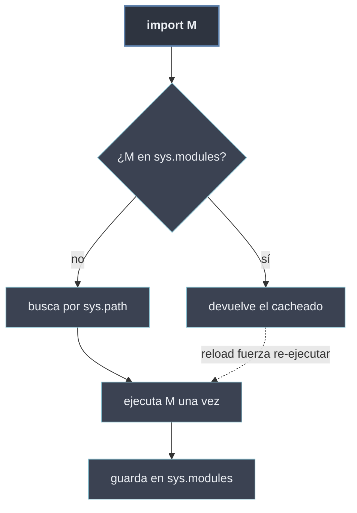

# Mecanismos de Importación

Los **mecanismos de importación** son la maquinaria interna que se dispara con cada `import`. Tres piezas la gobiernan: la **ruta de búsqueda** `sys.path`, que dice *dónde* buscar el módulo; la **caché** `sys.modules`, que evita volver a cargar lo ya importado y garantiza que cada módulo se ejecute **una sola vez**; y la **recarga** con `importlib.reload`, la excepción deliberada a esa regla para refrescar un módulo en caliente.

```python
import sys

sys.path                 # lista de rutas donde se busca (el "dónde")
sys.modules              # diccionario de módulos ya cargados (la caché)

import importlib
importlib.reload(sys)    # vuelve a ejecutar un módulo ya importado
```

## Las tres piezas

- [[01 sys.path y PYTHONPATH | sys.path y PYTHONPATH]] — la lista de rutas donde Python busca módulos, su orden, cómo modificarla y la variable de entorno `PYTHONPATH`.
- [[02 sys.modules (Cache) | sys.modules (Caché)]] — la caché de módulos ya importados; por qué un módulo solo se ejecuta una vez; inspeccionarla y limpiarla.
- [[03 Reloading (importlib.reload) | Reloading (importlib.reload)]] — recargar un módulo en caliente con `importlib.reload`, sus limitaciones y cuándo se usa (REPL, desarrollo).

## Mapa del mecanismo

| Pieza | Pregunta que responde | Hoja |
| ----- | --------------------- | ---- |
| `sys.path` / `PYTHONPATH` | ¿Dónde busca Python el módulo? | [[01 sys.path y PYTHONPATH \| sys.path y PYTHONPATH]] |
| `sys.modules` | ¿Por qué solo se carga una vez? | [[02 sys.modules (Cache) \| sys.modules (Caché)]] |
| `importlib.reload` | ¿Cómo lo recargo sin reiniciar? | [[03 Reloading (importlib.reload) \| Reloading]] |



Las tres piezas operan sobre la [[41 Jerarquia de Modulos/index | jerarquía de módulos]]: `sys.path` recorre los orígenes built-in → estándar → terceros → propios, y `sys.modules` cachea lo que de ahí se resuelva.
