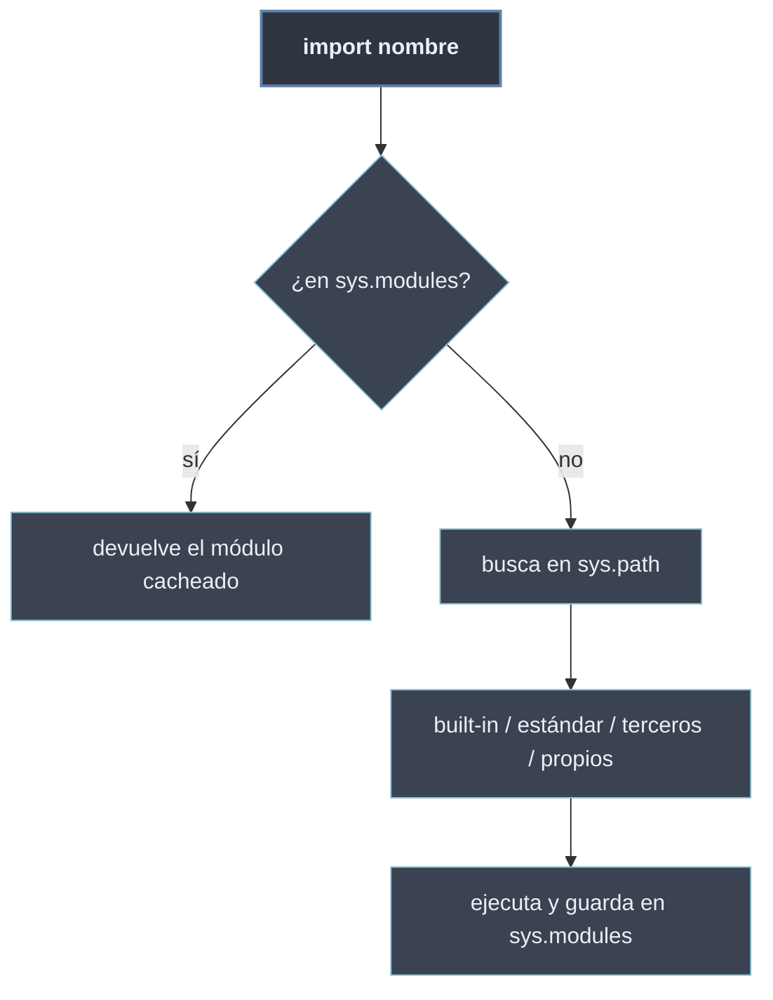

# Sistema de Módulos de Python

El **sistema de módulos** es la maquinaria con la que Python **clasifica, localiza y carga** todo el código importable. Tiene dos caras: una **jerarquía** que ordena los módulos por su origen —los compilados en el intérprete, los que trae la instalación, los instalados con `pip` y los del propio proyecto— y un **mecanismo de importación** que, ante un `import nombre`, decide *de dónde* sale ese módulo y *cómo* se carga una sola vez.

Donde [[20 Modulos en Python/index | Módulos en Python]] explica qué es un módulo y [[30 Paquetes y Subpaquetes/index | Paquetes y Subpaquetes]] cómo se agrupan, esta sección describe el **sistema que está debajo de todo `import`**: la búsqueda por `sys.path`, la caché de `sys.modules` y la recarga con `importlib`.

```python
import sys

sys.builtin_module_names          # tupla de los módulos compilados en el intérprete
'os' in sys.modules               # True tras importarlo: queda en caché
sys.path                          # lista de rutas donde se buscan los módulos
```

## Las dos caras del sistema

| Cara | Pregunta que responde | Subtema |
| ---- | --------------------- | ------- |
| **Jerarquía de módulos** | ¿De dónde viene un módulo? | [[41 Jerarquia de Modulos/index \| Jerarquía de Módulos]] |
| **Mecanismos de importación** | ¿Cómo lo encuentra y carga Python? | [[42 Mecanismos de Importacion/index \| Mecanismos de Importación]] |

## Subtemas

- [[41 Jerarquia de Modulos/index | Jerarquía de Módulos]] — los cuatro orígenes de un módulo: built-in compilados, librería estándar, terceros (`pip`/PyPI) y personalizados del proyecto.
- [[42 Mecanismos de Importacion/index | Mecanismos de Importación]] — cómo Python localiza y carga: `sys.path` y `PYTHONPATH`, la caché `sys.modules` y la recarga con `importlib.reload`.

## Mapa del sistema



Cuando se ejecuta `import nombre`, Python primero consulta la **caché** `sys.modules`; si no está, **busca** por las rutas de `sys.path` recorriendo la jerarquía de orígenes, **ejecuta** el módulo una sola vez y lo **guarda** en la caché. Toda la mecánica de [[20 Modulos en Python/22 Importacion de Modulos/index | importación]] descansa sobre estos dos pilares.
