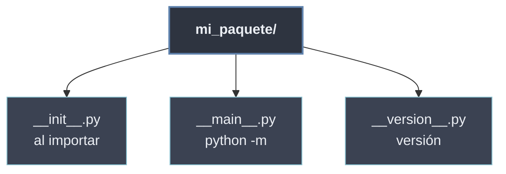

# Archivos Especiales

Los **archivos especiales** son ficheros con nombre *dunder* (`__nombre__.py`) que Python —o la convención de la comunidad— reconoce por su **nombre** y trata de forma particular dentro de un paquete. No son módulos cualquiera: cada uno cumple un **rol fijo** en el ciclo de vida del paquete (inicializarlo, hacerlo ejecutable, versionarlo).

```python
mi_paquete/
├── __init__.py      # se ejecuta al importar el paquete    -> reconocido por Python
├── __main__.py      # se ejecuta con  python -m mi_paquete  -> reconocido por Python
└── __version__.py   # define  __version__ = "1.2.3"          -> convención de la comunidad
```

Los dos primeros (`__init__`, `__main__`) los **interpreta el intérprete** automáticamente; el tercero (`__version__`) es solo una **convención de organización**: Python no le da trato especial, pero las herramientas y los usuarios esperan encontrar ahí la versión.

## Subtemas

- [[01 __init__.py | __init__.py]] — marca el directorio como paquete y se ejecuta al importarlo; sirve para inicializar y para re-exportar la API pública.
- [[02 __main__.py | __main__.py]] — punto de entrada ejecutable del paquete: lo que corre `python -m mi_paquete`.
- [[03 __version__.py | __version__.py]] — convención para exponer la versión del paquete en `__version__`.

## Mapa de los archivos especiales

| Archivo | Lo dispara | Rol |
| ------- | ---------- | --- |
| `__init__.py` | `import mi_paquete` | inicializa el paquete y define su API |
| `__main__.py` | `python -m mi_paquete` | punto de entrada ejecutable |
| `__version__.py` | (convención) | expone `__version__` |



Estos archivos son la base sobre la que se construyen tanto la [[52 Estructura de Directorios | estructura de directorios]] del proyecto como el [[60 Diseno de APIs Modulares/index | diseño de su API]]: `__init__.py`, en particular, es donde se decide qué nombres expone el paquete hacia fuera.
