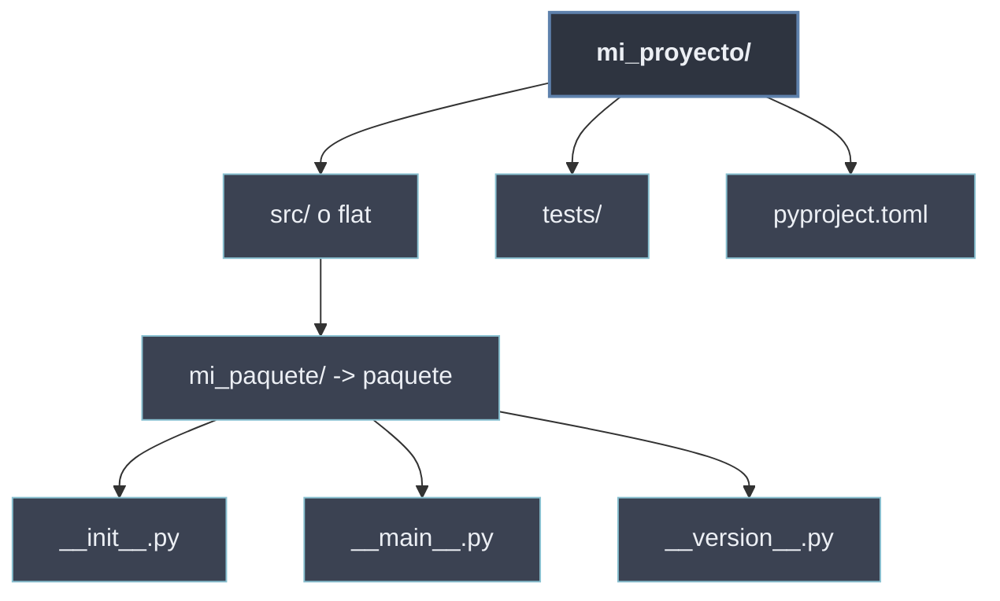

# Organización de Proyectos

**Organizar un proyecto** es decidir **dónde vive cada archivo** y **qué papel cumple**: qué directorios contienen el código, dónde van las pruebas, qué archivos especiales declaran y configuran el paquete, y cómo se nombran las piezas (módulo, paquete, subpaquete). Es la capa que convierte un montón de `.py` sueltos en un **proyecto instalable y mantenible**.

A diferencia de las secciones anteriores —que explican los **mecanismos** del lenguaje (`import`, `__init__.py`, `sys.path`)— aquí se trata la **convención de empaquetado**: el esqueleto de carpetas y los archivos *dunder* a nivel de proyecto que las herramientas (`pip`, `build`, `pytest`) esperan encontrar.

```python
# layout tipico de un proyecto instalable
mi_proyecto/
├── src/
│   └── mi_paquete/
│       ├── __init__.py        # declara el paquete y su API
│       ├── __main__.py        # python -m mi_paquete
│       ├── __version__.py     # "1.2.3"
│       └── core.py
├── tests/
├── pyproject.toml             # metadatos y configuracion de build
└── README.md
```

## Las tres preguntas que resuelve

| Pregunta | Responde | Dónde se trata |
| -------- | -------- | -------------- |
| ¿Qué archivos *dunder* declaran el paquete? | `__init__`, `__main__`, `__version__` | [[51 Archivos Especiales/index \| Archivos Especiales]] |
| ¿Cómo dispongo los directorios? | `src/` layout vs flat, `tests/`, `pyproject.toml` | [[52 Estructura de Directorios \| Estructura de Directorios]] |
| ¿Cómo nombro cada pieza? | módulo · paquete · subpaquete | [[53 Module vs Package vs Subpackage \| Module vs Package vs Subpackage]] |

## Subtemas

- [[51 Archivos Especiales/index | Archivos Especiales]] — los archivos *dunder* que Python reconoce por convención: `__init__.py` (inicializa el paquete), `__main__.py` (lo hace ejecutable) y `__version__.py` (expone la versión).
- [[52 Estructura de Directorios | Estructura de Directorios]] — los layouts típicos (`src/` vs *flat*), la carpeta `tests/`, los archivos de empaquetado `pyproject.toml` / `setup.py` y el `README`.
- [[53 Module vs Package vs Subpackage | Module vs Package vs Subpackage]] — las definiciones precisas: un **módulo** es un archivo, un **paquete** un directorio con `__init__.py`, un **subpaquete** un paquete anidado.

## Mapa de la organización



El esqueleto de directorios se apoya en los [[40 Sistema de Modulos de Python/index | mecanismos de importación]] (`sys.path` debe poder encontrar el paquete) y desemboca en el [[60 Diseno de APIs Modulares/index | diseño de la API]]: una vez ordenado el proyecto, `__init__.py` y `__all__` deciden qué expone hacia fuera.
