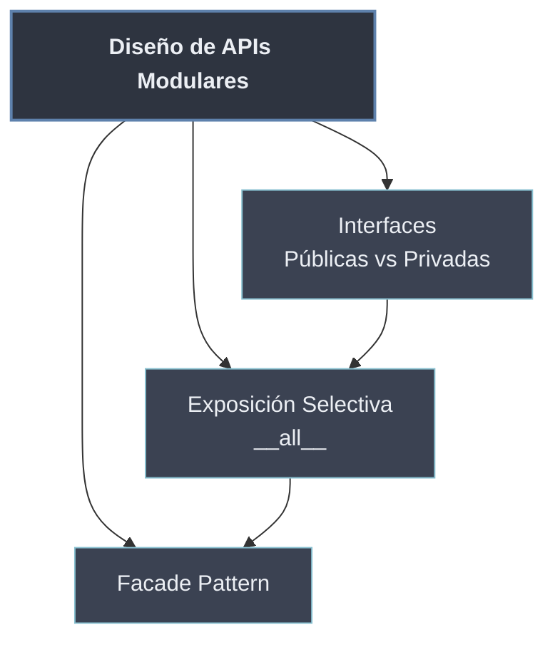

# Diseño de APIs Modulares

Un módulo o paquete bien hecho **no es solo código que funciona**: es una **interfaz** que otros van a usar e importar. Diseñar una **API modular** consiste en decidir qué nombres son **públicos** (la promesa que mantienes estable) y cuáles son **detalle de implementación** (libre de cambiar). Cuanto más pequeña y clara sea la superficie pública, más fácil es usar el módulo y más libertad tienes para evolucionarlo por dentro.

Esta es la cara externa de la [[10 Conceptos de Modularidad/index | encapsulación modular]]: igual que una clase expone métodos y oculta su estado, un módulo expone unos pocos nombres y reserva el resto. Python no obliga a ello —todo es accesible—, así que la API se construye con **convenciones** (`_privado`, `__all__`) y con **patrones** (Facade) que guían al consumidor hacia lo que de verdad debe tocar.

```python
# api.py  -> lo publico se ve; lo privado lleva guion bajo
__all__ = ["procesar"]            # superficie publica explicita

def procesar(datos):              # publico: contrato estable
    return _normalizar(datos)

def _normalizar(datos):           # privado: implementacion, puede cambiar
    return [d.strip() for d in datos]
```

## Subtemas

- [[61 Interfaces Publicas vs Privadas | Interfaces Públicas vs Privadas]] — qué nombres forman el contrato y cuáles son implementación; la convención `_nombre` y la estabilidad de la API.
- [[62 Exposicion Selectiva (__all__) | Exposición Selectiva (__all__)]] — `__all__` como lista de lo que exporta `from modulo import *` y declaración explícita de la superficie pública.
- [[63 Facade Pattern | Facade Pattern]] — un módulo o paquete que ofrece una interfaz simple y unificada sobre subsistemas complejos.

## Mapa de la sección

| Nota | Qué resuelve | Mecanismo |
| ---- | ------------ | --------- |
| Interfaces Públicas vs Privadas | qué es contrato y qué es detalle | convención `_nombre` \| docstrings |
| Exposición Selectiva (`__all__`) | declarar la superficie pública | `__all__ = [...]` |
| Facade Pattern | simplificar un subsistema complejo | re-exportar en `__init__.py` |



La progresión es natural: primero se **distingue** público de privado, luego se **declara** esa frontera con `__all__`, y finalmente se **simplifica** la cara del paquete con un Facade. Todo ello apoya el principio de bajo acoplamiento de [[10 Conceptos de Modularidad/index | Conceptos de Modularidad]] y se complementa con los [[70 Patrones de Diseno Modular/index | Patrones de Diseño Modular]].
