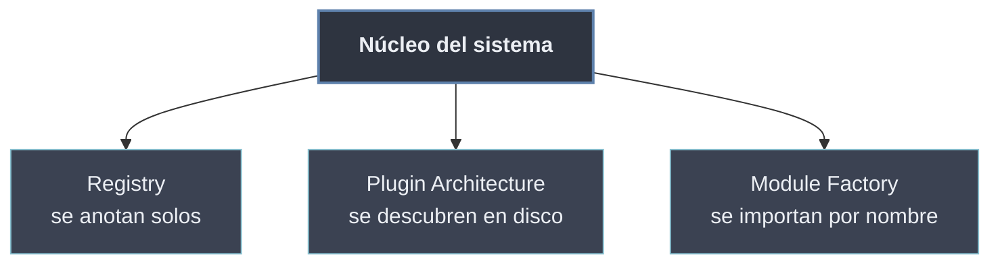

# Patrones de Diseño Modular

Mientras los [[Tema 02 Programación Orientada a Objetos/80 Patrones de Diseño/index | patrones de diseño clásicos]] organizan **clases y objetos** dentro de un programa, los **patrones modulares** organizan **módulos y paquetes** dentro de un sistema. Su objetivo es el mismo que gobierna todo el tema: **acoplamiento bajo**. El núcleo no debe conocer a las piezas concretas que lo extienden; son ellas las que se anuncian, se descubren o se construyen bajo demanda.

Los tres patrones de esta sección atacan la misma necesidad —**añadir capacidades sin tocar el núcleo**— desde tres ángulos: un registro central donde los módulos se anotan, un sistema que descubre extensiones en disco, y una fábrica que importa la implementación correcta por su nombre.

```python
# El nucleo solo conoce un registro; los modulos se anotan solos
@registrar("json")
def exportar_json(datos): ...

# ...y el nucleo elige por nombre, sin importar a nadie en concreto
exportador = REGISTRO["json"]
```

## Subtemas

- [[71 Registry Pattern | Registry Pattern]] — un `dict` central donde los componentes se **auto-registran**, típicamente con un decorador `@registrar`; desacopla quién define de quién usa.
- [[72 Plugin Architecture | Plugin Architecture]] — el sistema **descubre y carga plugins** en tiempo de ejecución (carpeta, *entry points* o `importlib`); el núcleo no conoce los plugins concretos.
- [[73 Module Factory | Module Factory]] — selección **dinámica de módulos por nombre** con `importlib.import_module`; una fábrica devuelve la implementación adecuada según la configuración.

## Mapa de patrones

| Patrón | Mecanismo | Qué desacopla | Subtema |
| ------ | --------- | ------------- | ------- |
| Registry | `dict` + decorador `@registrar` | quién **define** de quién **usa** | [[71 Registry Pattern \| Registry Pattern]] |
| Plugin Architecture | descubrimiento + `importlib` | el **núcleo** de sus **extensiones** | [[72 Plugin Architecture \| Plugin Architecture]] |
| Module Factory | `import_module(nombre)` | la **configuración** de la **implementación** | [[73 Module Factory \| Module Factory]] |



Los tres se apoyan en la maquinaria de [[40 Sistema de Modulos de Python/index | importación de Python]] (`sys.modules`, `importlib`) y en una [[60 Diseno de APIs Modulares/index | API modular]] bien definida: una interfaz estable que las piezas concretas implementan sin que el núcleo las conozca.
</content>
</invoke>
