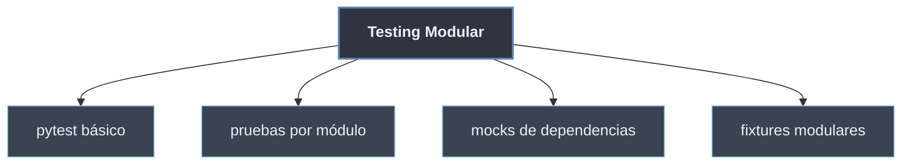

# Testing Modular

La **modularidad** solo se sostiene si cada módulo puede **probarse por separado**. Un buen diseño modular —alta cohesión, bajo acoplamiento— hace que cada unidad tenga una interfaz pequeña y clara, justo lo que un test necesita para verificarla **de forma aislada**, sin arrastrar el resto del sistema. El **testing modular** aplica esa idea: una batería de pruebas por módulo que valida su interfaz pública y aísla sus dependencias externas.

La herramienta de referencia en Python es **`pytest`**: descubre los tests por convención de nombres, usa `assert` plano y ofrece *fixtures* y *mocks* para preparar el estado y sustituir las dependencias del módulo bajo prueba.

```python
# modulo: geometria.py
def area_circulo(r):
    return 3.14159 * r ** 2

# test: test_geometria.py  -> prueba aislada de un solo módulo
from geometria import area_circulo

def test_area_circulo():
    assert area_circulo(2) == 12.56636
```

## Subtemas

- [[81 Pytest Basico | Pytest Básico]] — qué es `pytest`, archivos `test_*.py`, funciones `test_*`, `assert` plano y lectura de la salida.
- [[82 Pruebas por Modulo | Pruebas por Módulo]] — un `test_<modulo>.py` por módulo, la carpeta `tests/` como espejo del paquete y el foco en la interfaz pública.
- [[83 Mocks para Dependencias Externas | Mocks para Dependencias Externas]] — aislar el módulo de la red, el disco o la BD con `unittest.mock` (`Mock`, `patch`) y `monkeypatch`.
- [[84 Fixtures Modulares | Fixtures Modulares]] — `@pytest.fixture` para preparar/limpiar estado, `conftest.py` para fixtures compartidas y los ámbitos `function`/`module`/`session`.

## Mapa de la sección

| Pieza | Para qué sirve | Subtema |
| ----- | -------------- | ------- |
| `pytest` | Ejecutar y descubrir los tests por convención | [[81 Pytest Basico \| Pytest Básico]] |
| `test_<modulo>.py` | Espejar la estructura del paquete | [[82 Pruebas por Modulo \| Pruebas por Módulo]] |
| `Mock` / `patch` / `monkeypatch` | Sustituir dependencias externas | [[83 Mocks para Dependencias Externas \| Mocks para Dependencias Externas]] |
| `@pytest.fixture` / `conftest.py` | Preparar y reutilizar estado de prueba | [[84 Fixtures Modulares \| Fixtures Modulares]] |



El testing cierra el ciclo de la [[80 Testing Modular/index | programación modular]]: las secciones anteriores enseñan a **construir** módulos y paquetes con buenas interfaces; esta enseña a **verificar** que cada uno cumple su contrato sin depender de los demás. El [[60 Diseno de APIs Modulares/index | diseño de APIs modulares]] y el testing se refuerzan: cuanto más limpia es la interfaz pública, más fácil es probarla.
