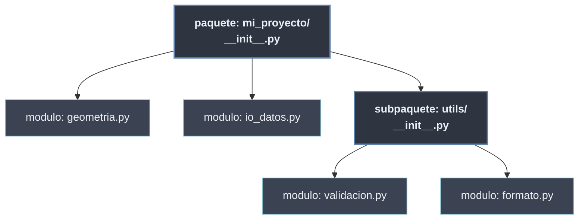

# Programación Modular

La **programación modular** organiza un programa en **unidades independientes y reutilizables** —los **módulos**— cada una con una responsabilidad clara y una interfaz definida. Es el paso natural tras la [[Tema 02 Programación Orientada a Objetos/index | orientación a objetos]]: donde la POO estructura *un* archivo en clases, la modularidad estructura *el sistema entero* en archivos y paquetes que colaboran sin pisarse.

Llega después de POO de forma deliberada: en Python **un módulo también es un objeto** (una instancia de `module`), con su propio *namespace*. Quien ya entiende objetos y namespaces entiende que diseñar paquetes es **diseñar arquitectura**, no solo repartir funciones en ficheros.

```python
# geometria.py  -> un modulo: un archivo .py con un namespace propio
PI = 3.14159
def area_circulo(r):
    return PI * r ** 2

# main.py  -> consume el modulo por su interfaz publica
import geometria
geometria.area_circulo(2)        # 12.566...
from geometria import PI         # import selectivo
```

## Las dos ideas que lo gobiernan

| Idea | Significado | Dónde se trata |
| ---- | ----------- | -------------- |
| **Cohesión alta** | cada módulo hace **una** cosa y la hace bien | [[10 Conceptos de Modularidad/index \| Conceptos de Modularidad]] |
| **Acoplamiento bajo** | los módulos dependen **lo mínimo** entre sí, a través de interfaces | [[10 Conceptos de Modularidad/index \| Conceptos de Modularidad]] |

Todo lo demás —importaciones, paquetes, `__init__.py`, `__all__`, patrones— son los **mecanismos** con que Python materializa esas dos ideas.

## Subtemas

- [[10 Conceptos de Modularidad/index | Conceptos de Modularidad]] — qué es un módulo, sus ventajas, cohesión/acoplamiento y la encapsulación a nivel de módulo.
- [[20 Modulos en Python/index | Módulos en Python]] — el archivo `.py` como módulo: namespace, `__name__`/`__main__` y las formas de `import`.
- [[30 Paquetes y Subpaquetes/index | Paquetes y Subpaquetes]] — directorios con `__init__.py`, paquetes anidados e importación absoluta vs relativa.
- [[40 Sistema de Modulos de Python/index | Sistema de Módulos de Python]] — la jerarquía built-in → estándar → terceros → propios y la maquinaria de importación (`sys.path`, `sys.modules`).
- [[50 Organizacion de Proyectos/index | Organización de Proyectos]] — estructura de directorios, archivos especiales (`__init__`, `__main__`, `__version__`) y module vs package.
- [[60 Diseno de APIs Modulares/index | Diseño de APIs Modulares]] — interfaz pública vs implementación privada, `__all__` y el patrón Facade.
- [[70 Patrones de Diseno Modular/index | Patrones de Diseño Modular]] — Registry, Plugin Architecture y Module Factory.
- [[80 Testing Modular/index | Testing Modular]] — `pytest` básico, pruebas por módulo, *mocks* y *fixtures*.
- [[00 Referencias/index | Referencias]] — glosario modular y catálogo de archivos especiales.

## Del módulo al paquete



Un **módulo** es un archivo; un **paquete** es un directorio de módulos con un `__init__.py` que lo declara como tal. Sobre esa jerarquía se construyen la importación, la organización de proyectos y el diseño de APIs que cubren el resto de secciones.
